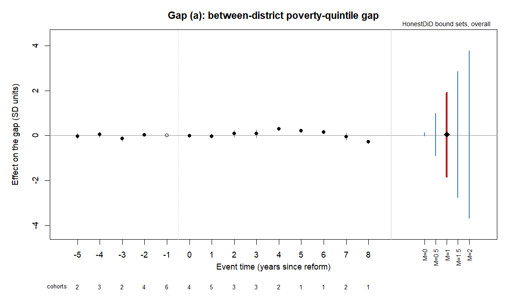
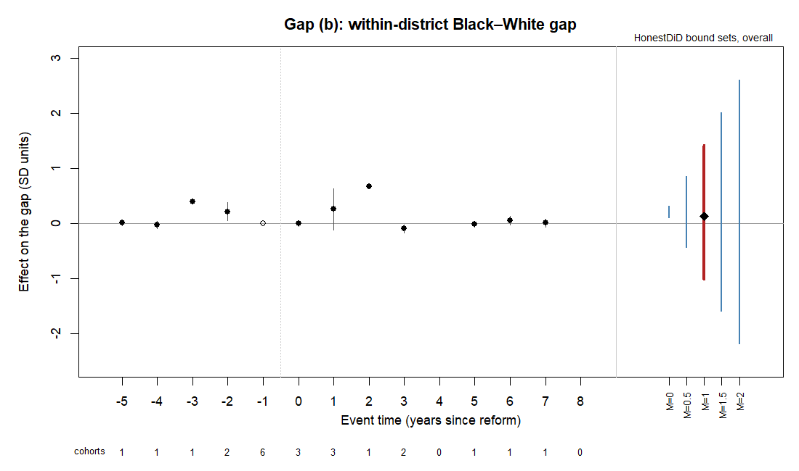
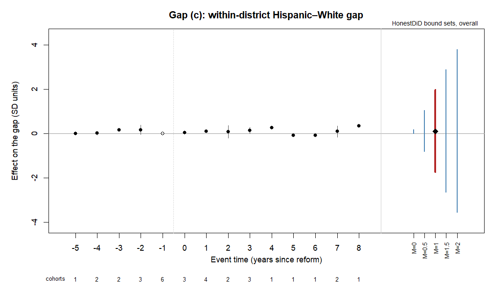
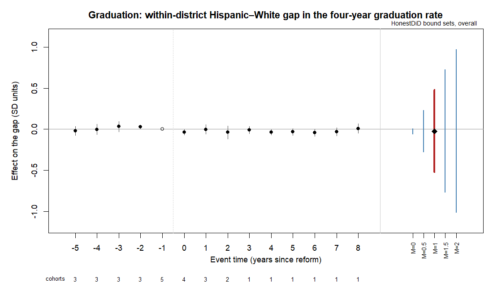

# Section 13 report

Run 20260914T210951Z; blinding status **REAL**.

The study is registered as a bounds analysis (Section 10). For each gap the honest-DiD bound sets come first; the headline is the bound set at M̄ = 1, and all five M̄ values are shown. Point estimates, p-values and intervals are reported as quantities, and no result is described as statistically significant.

Primary specification: Callaway–Sant'Anna, not-yet-treated controls, doubly robust, unbalanced panel, primary suppression sample, reference period −1, primary event set, unweighted. Event-time and overall intervals are Webb wild cluster bootstrap intervals (9,999 draws, state clusters).

## Answer to the research question, by gap

| gap | outcome | sd_interval_mbar1 | per_1000_interval |
|---|---|---|---|
| a_poverty | achievement | [-1.824, 1.917] | unbounded (the revenue effect's bootstrap interval includes zero) |
| b_black_white | achievement | [-1.011, 1.426] (event times -5..+3) | unbounded (the revenue effect's bootstrap interval includes zero) |
| c_hispanic_white | achievement | [-1.744, 1.968] | unbounded (the revenue effect's bootstrap interval includes zero) |
| grad_black_white | graduation | [-3.055, 2.895] | [0.092, 0.207] |
| grad_hispanic_white | graduation | [-0.523, 0.482] | [-0.018, 0.100] |

# Primary achievement gaps

## Gap (a): between-district poverty-quintile gap

### 1. Honest-DiD bound sets (relative magnitudes, overall post-reform average)

Each M̄ starts on HonestDiD's default grid (±20 standard deviations of the overall estimate, 1,000 points); a grid that a bound set reaches is widened on that side at the same step until no reported bound touches an edge (code correction 2026-09-14).

| M̄ | lower | upper | width | status | grid | headline |
|---|---|---|---|---|---|---|
| original CS (no restriction) | -0.014 | 0.124 | 0.139 | ok | – |  |
| 0 | -0.013 | 0.124 | 0.137 | ok | [-0.707, 0.707], 1000 points |  |
| 0.5 | -0.897 | 0.989 | 1.886 | ok | [-2.122, 2.122], 2998 points |  |
| 1 | -1.824 | 1.917 | 3.741 | ok | [-2.122, 2.122], 2998 points | **headline** |
| 1.5 | -2.748 | 2.841 | 5.589 | ok | [-6.365, 6.365], 8992 points |  |
| 2 | -3.669 | 3.763 | 7.432 | ok | [-6.365, 6.365], 8992 points |  |

### 2. Event study with honest-DiD bounds and cohorts per coefficient

| event_time | estimate | boot_ci | boot_p | cohorts | treated_states | treated_units | reference |
|---|---|---|---|---|---|---|---|
| -5 | -0.033 | [-0.157, 0.092] | 0.6293 | 2 | 2 | 2 |  |
| -4 | 0.052 | [-0.075, 0.178] | 0.4962 | 3 | 3 | 3 |  |
| -3 | -0.141 | [-0.257, -0.024] | 0.0034 | 2 | 2 | 2 |  |
| -2 | 0.032 | [-0.032, 0.097] | 0.3940 | 4 | 4 | 4 |  |
| -1 | 0.000 | – | – | 6 | 6 | 6 | ref |
|  0 | -0.004 | [-0.062, 0.054] | 0.9036 | 4 | 4 | 4 |  |
|  1 | -0.025 | [-0.118, 0.068] | 0.6354 | 5 | 5 | 5 |  |
|  2 | 0.088 | [-0.047, 0.223] | 0.3547 | 3 | 3 | 3 |  |
|  3 | 0.080 | [-0.096, 0.257] | 0.4624 | 3 | 3 | 3 |  |
|  4 | 0.301 | [0.228, 0.375] | 0.0001 | 2 | 2 | 2 |  |
|  5 | 0.214 | [0.138, 0.291] | 0.0001 | 1 | 1 | 1 |  |
|  6 | 0.156 | [0.060, 0.252] | 0.0011 | 1 | 1 | 1 |  |
|  7 | -0.046 | [-0.205, 0.113] | 0.5969 | 2 | 2 | 2 |  |
|  8 | -0.270 | [-0.351, -0.189] | 0.0001 | 1 | 1 | 1 |  |

### 3. Overall post-reform average

| estimate | clustered_se | boot_ci | boot_p | randomization_p | randomization_reps | romano_wolf_p | cohorts | treated_states | model_status |
|---|---|---|---|---|---|---|---|---|---|
| 0.055 | 0.035 | [-0.012, 0.122] | 0.1183 | 0.5027 | 10000 | 0.1183 | 5 | 5 | ok |

### 4. Dose-scaled estimate (per $1,000 of per-pupil state-plus-local revenue, 2021 dollars)

Revenue effect: the same Callaway–Sant'Anna model with F-33 (TSTREV + TLOCREV) / V33 in thousands of 2021 dollars as the outcome (the 2009-10 membership-weighted top-minus-bottom poverty-quintile gap in revenue per pupil). District-years with F-33 enrollment below 30 or revenue above $100,000 per pupil (2021 dollars) are excluded: 116 of the 34026 district-years in scope (100 below 30 enrolled, 28 above $100,000). The dose-scaled estimate is the ratio of the two overall effects (the Wald form of the two-stage estimate), with a percentile interval from the step 7 Webb draws applied to both. **Assumption:** the reform affects the gap only through revenue (exclusion restriction); accountability or other provisions enacted with a reform would violate it. The assumption is stated, not tested.

| effect_sd | revenue_effect | revenue_boot_ci | sd_per_1000 | interval_per_1000 | status |
|---|---|---|---|---|---|
| 0.055 | -0.023 | [-0.633, 0.607] | -2.362 | unbounded | unbounded: the revenue effect's bootstrap interval includes zero |

### 5. Lee bounds

Not computed for gap (a) (author decision 2026-09-13).

### 6. Estimator agreement (unbalanced panel, primary event set)

Secondary intervals are each estimator's own state-clustered or placebo interval; the stacked regression averages event times 0..+5; two-way fixed effects rows are for comparison only.

| estimator | estimate | se | ci | status |
|---|---|---|---|---|
| callaway_santanna (primary) | 0.055 | 0.035 | [-0.012, 0.122] | ok |
| sun_abraham | 0.048 | 0.022 | [0.005, 0.090] | ok |
| imputation | 0.031 | 0.024 | [-0.016, 0.078] | ok |
| synthdid | 0.100 | 0.135 | [-0.164, 0.364] | ok |
| stacked | 0.073 | 0.041 | [-0.007, 0.153] | ok |
| twfe | 0.008 | 0.049 | [-0.087, 0.103] | ok |
| twfe_static | 0.034 | 0.052 | [-0.067, 0.136] | ok |

### 7. Weighted comparison

Gap (a) is a state-level outcome and has no weighted version (Section 7).

### 8. Narrower event definitions

r1 = LRS list plus final state supreme court rulings; r2 = court rulings only.

| event_set | estimate | boot_ci | boot_p | randomization_p | bound_mbar1 | sd_per_1000 | status |
|---|---|---|---|---|---|---|---|
| primary | 0.055 | [-0.012, 0.122] | 0.1183 | 0.5027 | [-1.824, 1.917] | -2.362 | ok |
| r1 | 0.080 | [0.003, 0.158] | 0.0383 | 0.3785 | [-0.604, 0.744] | -0.485 | ok |
| r2 | -0.060 | [-0.105, -0.015] | 0.0049 | 0.5560 | no bound (no estimated pre-reform event time: relative magnitudes need one) | -0.166 | ok |

### 9. Registered robustness checks (primary event set, unweighted)

Variants on all three event sets and both weightings, with event times, Romano–Wolf families and every M̄: outputs/10_run_all/variants/. Randomization inference uses 1,000 reassignments on the variants (compute deviation, 2026-09-13).

| check | estimate | boot_p | randomization_p | randomization_reps | bound_mbar1 | status |
|---|---|---|---|---|---|---|
| Balanced panel (Section 7) | 0.134 | 0.0001 | 0.2725 | 10000 | [-0.581, 0.861] | ok |
| Ranges of 5 points or less (Section 5 rule 3) | 0.060 | 0.0725 | 0.5015 | 1000 | [-4.385, 4.544] | ok |
| Exact values only (Section 5 rule 3) | 0.076 | 0.0089 | 0.4226 | 1000 | [-0.454, 0.544] (event times -5..+3) | ok |
| End years 2013 on, participation rule throughout (Section 5 rule 4) | 0.018 | 0.6890 | 0.8152 | 1000 | [-1.134, 1.108] | ok |
| Cohorts with fewer than three pre-reform years dropped (Section 5 rule 6) | 0.018 | 0.6863 | 0.8152 | 1000 | [-1.134, 1.108] | ok |
| Anticipation = 1, reference period -2 (Section 7; replaces the filing-date version) | 0.047 | 0.2046 | 0.6154 | 1000 | [-1.234, 1.300] | ok |

### Answer, stated as intervals

SD units: honest-DiD bound set at M̄ = 1, [-1.824, 1.917]. Per $1,000 of per-pupil revenue: unbounded (the revenue effect's bootstrap interval includes zero) (percentile interval of the dose-scaled ratio; the two intervals rest on different assumptions: the first on bounded departures from parallel trends, the second on parallel trends and the exclusion restriction).

## Gap (b): within-district Black–White gap

### 1. Honest-DiD bound sets (relative magnitudes, overall post-reform average)

Each M̄ starts on HonestDiD's default grid (±20 standard deviations of the overall estimate, 1,000 points); a grid that a bound set reaches is widened on that side at the same step until no reported bound touches an edge (code correction 2026-09-14).

| M̄ | lower | upper | width | status | grid | headline | event_block |
|---|---|---|---|---|---|---|---|
| original CS (no restriction) | 0.104 | 0.311 | 0.207 | ok | – |  | bound on event times -5..+3; post-reform average over event times 0..+3 |
| 0 | 0.107 | 0.308 | 0.201 | ok | [-1.058, 1.058], 1000 points |  | bound on event times -5..+3; post-reform average over event times 0..+3 |
| 0.5 | -0.433 | 0.848 | 1.281 | ok | [-1.058, 1.058], 1000 points |  | bound on event times -5..+3; post-reform average over event times 0..+3 |
| 1 | -1.011 | 1.426 | 2.437 | ok | [-1.058, 3.173], 1999 points | **headline** | bound on event times -5..+3; post-reform average over event times 0..+3 |
| 1.5 | -1.598 | 2.013 | 3.610 | ok | [-3.173, 3.173], 2998 points |  | bound on event times -5..+3; post-reform average over event times 0..+3 |
| 2 | -2.188 | 2.603 | 4.792 | ok | [-3.173, 3.173], 2998 points |  | bound on event times -5..+3; post-reform average over event times 0..+3 |

### 2. Event study with honest-DiD bounds and cohorts per coefficient

| event_time | estimate | boot_ci | boot_p | cohorts | treated_states | treated_units | reference |
|---|---|---|---|---|---|---|---|
| -5 | 0.007 | [-0.043, 0.057] | 0.7945 | 1 | 1 |  76 |  |
| -4 | -0.028 | [-0.092, 0.035] | 0.4631 | 1 | 1 |  76 |  |
| -3 | 0.399 | [0.352, 0.445] | 0.0001 | 1 | 1 |  76 |  |
| -2 | 0.212 | [0.047, 0.378] | 0.0001 | 2 | 2 | 119 |  |
| -1 | 0.000 | – | – | 6 | 6 | 163 | ref |
|  0 | 0.001 | [-0.050, 0.053] | 0.9636 | 3 | 3 | 150 |  |
|  1 | 0.257 | [-0.122, 0.636] | 0.2875 | 3 | 3 | 150 |  |
|  2 | 0.670 | [0.631, 0.710] | 0.0001 | 1 | 1 |  43 |  |
|  3 | -0.098 | [-0.173, -0.023] | 0.0077 | 2 | 2 | 119 |  |
|  4 | – | – | – | 0 | 0 |   0 |  |
|  5 | -0.018 | [-0.072, 0.035] | 0.5335 | 1 | 1 |  43 |  |
|  6 | 0.050 | [-0.029, 0.130] | 0.2295 | 1 | 1 |  43 |  |
|  7 | 0.008 | [-0.063, 0.080] | 0.8234 | 1 | 1 |  43 |  |
|  8 | – | – | – | 0 | 0 |   0 |  |

### 3. Overall post-reform average

| estimate | clustered_se | boot_ci | boot_p | randomization_p | randomization_reps | romano_wolf_p | cohorts | treated_states | model_status |
|---|---|---|---|---|---|---|---|---|---|
| 0.124 | 0.036 | [0.056, 0.193] | 0.0001 | 0.1624 | 10000 | 0.0001 | 3 | 3 | ok |

### 4. Dose-scaled estimate (per $1,000 of per-pupil state-plus-local revenue, 2021 dollars)

Revenue effect: the same Callaway–Sant'Anna model with F-33 (TSTREV + TLOCREV) / V33 in thousands of 2021 dollars as the outcome (district revenue per pupil). District-years with F-33 enrollment below 30 or revenue above $100,000 per pupil (2021 dollars) are excluded: 2 of the 17343 district-years in scope (0 below 30 enrolled, 2 above $100,000). The dose-scaled estimate is the ratio of the two overall effects (the Wald form of the two-stage estimate), with a percentile interval from the step 7 Webb draws applied to both. **Assumption:** the reform affects the gap only through revenue (exclusion restriction); accountability or other provisions enacted with a reform would violate it. The assumption is stated, not tested.

| effect_sd | revenue_effect | revenue_boot_ci | sd_per_1000 | interval_per_1000 | status |
|---|---|---|---|---|---|
| 0.124 | 0.340 | [-0.286, 0.974] | 0.366 | unbounded | unbounded: the revenue effect's bootstrap interval includes zero |

### 5. Lee bounds

Tested share = the subgroup's tested count (mean of math and RLA) over its CCD grade 9 membership three years earlier, all-students counts where race-by-grade membership is unavailable; every window year (grade 9 membership from the CCD school files for 2006-07 on). For each of the gap's two groups, q_T is the treated post-reform share (aggregated as the overall effect), q_C = q_T minus the Callaway–Sant'Anna effect on the share, and p = 1 − q_C / q_T. The trimming fraction is the differential change of Section 9, |p_minority − p_white|, bounded to [0, 1] (operationalization correction 2026-09-14). The treated post-reform district-years lose that share from the top and, separately, from the bottom of the outcome distribution, and the primary model is refitted each way. The bracket assumes monotone selection.

| p_minority | p_white | trim_fraction | trimmed_treated_post_district_years | estimate_trim_top | estimate_trim_bottom | lee_bracket | status |
|---|---|---|---|---|---|---|---|
| -0.0419 | -0.0225 | 0.0195 | 7 of 337 | 0.112 | 0.131 | [0.112, 0.131] | ok |

### 6. Estimator agreement (unbalanced panel, primary event set)

Secondary intervals are each estimator's own state-clustered or placebo interval; the stacked regression averages event times 0..+5; two-way fixed effects rows are for comparison only.

| estimator | estimate | se | ci | status |
|---|---|---|---|---|
| callaway_santanna (primary) | 0.124 | 0.036 | [0.056, 0.193] | ok |
| sun_abraham | 0.033 | 0.020 | [-0.006, 0.072] | ok |
| imputation | 0.087 | 0.018 | [0.053, 0.122] | ok |
| synthdid | 0.078 | 0.107 | [-0.131, 0.287] | ok |
| stacked | 0.073 | 0.022 | [0.029, 0.116] | ok |
| twfe | 0.039 | 0.028 | [-0.015, 0.093] | ok |
| twfe_static | 0.005 | 0.019 | [-0.031, 0.042] | ok |

### 7. Weighted comparison

tested_weighted: students tested in the gap's two groups in 2009-10, mean of math and RLA, fixed. units = treated units behind the overall average.

| weighting | estimate | boot_p | randomization_p | bound_mbar1 | units | status |
|---|---|---|---|---|---|---|
| unweighted | 0.124 | 0.0001 | 0.1624 | [-1.011, 1.426] (event times -5..+3) | 150 | ok |
| tested_weighted | -0.036 | 0.1867 | 0.7026 | [-0.923, 0.833] (event times -5..+1) | 123 | ok |

### 8. Narrower event definitions

r1 = LRS list plus final state supreme court rulings; r2 = court rulings only.

| event_set | estimate | boot_ci | boot_p | randomization_p | bound_mbar1 | sd_per_1000 | status |
|---|---|---|---|---|---|---|---|
| primary | 0.124 | [0.056, 0.193] | 0.0001 | 0.1624 | [-1.011, 1.426] (event times -5..+3) | 0.366 | ok |
| r1 | 0.150 | [0.053, 0.247] | 0.0001 | 0.1313 | [-0.022, 0.533] (event times -2..+3) | 0.503 | ok |
| r2 | -0.039 | [-0.071, -0.007] | 0.0136 | 0.5619 | no bound (no estimated pre-reform event time: relative magnitudes need one) | -0.059 | ok |

### 9. Registered robustness checks (primary event set, unweighted)

Variants on all three event sets and both weightings, with event times, Romano–Wolf families and every M̄: outputs/10_run_all/variants/. Randomization inference uses 1,000 reassignments on the variants (compute deviation, 2026-09-13).

| check | estimate | boot_p | randomization_p | randomization_reps | bound_mbar1 | status |
|---|---|---|---|---|---|---|
| Balanced panel (Section 7) | – | not estimable: error: No valid att_gt() estimates found for this aggregation. This may happen if all estimates for a particular group or time period are NA. | not estimable: error: No valid att_gt() estimates found for this aggregation. This may happen if all estimates for a particular group or time period are NA. | not estimable: error: No valid att_gt() estimates found for this aggregation. This may happen if all estimates for a particular group or time period are NA. | not estimable: error: No valid att_gt() estimates found for this aggregation. This may happen if all estimates for a particular group or time period are NA. | error: No valid att_gt() estimates found for this aggregation. This may happen if all estimates for a particular group or time period are NA. |
| Ranges of 5 points or less (Section 5 rule 3) | 0.022 | 0.4655 | 0.7925 | 1000 | [-0.575, 0.656] (event times -2..+1) | ok |
| Exact values only (Section 5 rule 3) | -0.012 | 0.4501 | 0.8815 | 1000 | [-0.198, 0.156] | ok |
| End years 2013 on, participation rule throughout (Section 5 rule 4) | -0.013 | 0.5967 | 0.8591 | 1000 | [-0.720, 0.730] (event times -5..+1) | ok |
| Cohorts with fewer than three pre-reform years dropped (Section 5 rule 6) | -0.013 | 0.5925 | 0.8770 | 1000 | [-0.720, 0.730] (event times -5..+1) | ok |
| Anticipation = 1, reference period -2 (Section 7; replaces the filing-date version) | 0.029 | 0.6372 | 0.7543 | 1000 | [-1.880, 1.807] (event times -5..+3) | ok |

### Answer, stated as intervals

SD units: honest-DiD bound set at M̄ = 1, [-1.011, 1.426] (event times -5..+3). Per $1,000 of per-pupil revenue: unbounded (the revenue effect's bootstrap interval includes zero) (percentile interval of the dose-scaled ratio; the two intervals rest on different assumptions: the first on bounded departures from parallel trends, the second on parallel trends and the exclusion restriction).

## Gap (c): within-district Hispanic–White gap

### 1. Honest-DiD bound sets (relative magnitudes, overall post-reform average)

Each M̄ starts on HonestDiD's default grid (±20 standard deviations of the overall estimate, 1,000 points); a grid that a bound set reaches is widened on that side at the same step until no reported bound touches an edge (code correction 2026-09-14).

| M̄ | lower | upper | width | status | grid | headline |
|---|---|---|---|---|---|---|
| original CS (no restriction) | -0.001 | 0.186 | 0.187 | ok | – |  |
| 0 | -0.001 | 0.184 | 0.185 | ok | [-0.954, 0.954], 1000 points |  |
| 0.5 | -0.822 | 1.051 | 1.873 | ok | [-0.954, 2.861], 1999 points |  |
| 1 | -1.744 | 1.968 | 3.712 | ok | [-2.861, 2.861], 2998 points | **headline** |
| 1.5 | -2.651 | 2.873 | 5.524 | ok | [-2.861, 8.583], 5995 points |  |
| 2 | -3.558 | 3.783 | 7.341 | ok | [-8.583, 8.583], 8992 points |  |

### 2. Event study with honest-DiD bounds and cohorts per coefficient

| event_time | estimate | boot_ci | boot_p | cohorts | treated_states | treated_units | reference |
|---|---|---|---|---|---|---|---|
| -5 | -0.002 | [-0.045, 0.041] | 0.9342 | 1 | 1 | 116 |  |
| -4 | 0.007 | [-0.060, 0.074] | 0.8501 | 2 | 2 | 126 |  |
| -3 | 0.163 | [0.124, 0.203] | 0.0001 | 2 | 2 | 126 |  |
| -2 | 0.159 | [-0.056, 0.374] | 0.3209 | 3 | 3 | 194 |  |
| -1 | 0.000 | – | – | 6 | 6 | 339 | ref |
|  0 | 0.041 | [-0.000, 0.081] | 0.0505 | 3 | 3 | 279 |  |
|  1 | 0.085 | [0.034, 0.135] | 0.0001 | 4 | 4 | 289 |  |
|  2 | 0.070 | [-0.211, 0.350] | 0.5295 | 2 | 2 | 163 |  |
|  3 | 0.137 | [-0.009, 0.282] | 0.0778 | 3 | 3 | 279 |  |
|  4 | 0.249 | [0.196, 0.303] | 0.0001 | 1 | 1 |  68 |  |
|  5 | -0.085 | [-0.142, -0.028] | 0.0013 | 1 | 1 |  68 |  |
|  6 | -0.097 | [-0.154, -0.040] | 0.0002 | 1 | 1 |  68 |  |
|  7 | 0.087 | [-0.160, 0.333] | 0.5081 | 2 | 2 | 163 |  |
|  8 | 0.346 | [0.301, 0.391] | 0.0001 | 1 | 1 |  95 |  |

### 3. Overall post-reform average

| estimate | clustered_se | boot_ci | boot_p | randomization_p | randomization_reps | romano_wolf_p | cohorts | treated_states | model_status |
|---|---|---|---|---|---|---|---|---|---|
| 0.092 | 0.048 | [0.007, 0.177] | 0.0228 | 0.2082 | 10000 | 0.0654 | 4 | 4 | ok |

### 4. Dose-scaled estimate (per $1,000 of per-pupil state-plus-local revenue, 2021 dollars)

Revenue effect: the same Callaway–Sant'Anna model with F-33 (TSTREV + TLOCREV) / V33 in thousands of 2021 dollars as the outcome (district revenue per pupil). District-years with F-33 enrollment below 30 or revenue above $100,000 per pupil (2021 dollars) are excluded: 8 of the 20910 district-years in scope (0 below 30 enrolled, 8 above $100,000). The dose-scaled estimate is the ratio of the two overall effects (the Wald form of the two-stage estimate), with a percentile interval from the step 7 Webb draws applied to both. **Assumption:** the reform affects the gap only through revenue (exclusion restriction); accountability or other provisions enacted with a reform would violate it. The assumption is stated, not tested.

| effect_sd | revenue_effect | revenue_boot_ci | sd_per_1000 | interval_per_1000 | status |
|---|---|---|---|---|---|
| 0.092 | 0.631 | [-0.002, 1.266] | 0.146 | unbounded | unbounded: the revenue effect's bootstrap interval includes zero |

### 5. Lee bounds

Tested share = the subgroup's tested count (mean of math and RLA) over its CCD grade 9 membership three years earlier, all-students counts where race-by-grade membership is unavailable; every window year (grade 9 membership from the CCD school files for 2006-07 on). For each of the gap's two groups, q_T is the treated post-reform share (aggregated as the overall effect), q_C = q_T minus the Callaway–Sant'Anna effect on the share, and p = 1 − q_C / q_T. The trimming fraction is the differential change of Section 9, |p_minority − p_white|, bounded to [0, 1] (operationalization correction 2026-09-14). The treated post-reform district-years lose that share from the top and, separately, from the bottom of the outcome distribution, and the primary model is refitted each way. The bracket assumes monotone selection.

| p_minority | p_white | trim_fraction | trimmed_treated_post_district_years | estimate_trim_top | estimate_trim_bottom | lee_bracket | status |
|---|---|---|---|---|---|---|---|
| -0.0865 | -0.0837 | 0.0028 | 2 of 770 | 0.090 | 0.093 | [0.090, 0.093] | ok |

### 6. Estimator agreement (unbalanced panel, primary event set)

Secondary intervals are each estimator's own state-clustered or placebo interval; the stacked regression averages event times 0..+5; two-way fixed effects rows are for comparison only.

| estimator | estimate | se | ci | status |
|---|---|---|---|---|
| callaway_santanna (primary) | 0.092 | 0.048 | [0.007, 0.177] | ok |
| sun_abraham | -0.003 | 0.010 | [-0.023, 0.016] | ok |
| imputation | 0.007 | 0.011 | [-0.015, 0.029] | ok |
| synthdid | 0.023 | 0.070 | [-0.114, 0.159] | ok |
| stacked | 0.034 | 0.031 | [-0.026, 0.095] | ok |
| twfe | 0.023 | 0.029 | [-0.033, 0.079] | ok |
| twfe_static | 0.010 | 0.021 | [-0.032, 0.053] | ok |

### 7. Weighted comparison

tested_weighted: students tested in the gap's two groups in 2009-10, mean of math and RLA, fixed. units = treated units behind the overall average.

| weighting | estimate | boot_p | randomization_p | bound_mbar1 | units | status |
|---|---|---|---|---|---|---|
| unweighted | 0.092 | 0.0228 | 0.2082 | [-1.744, 1.968] | 289 | ok |
| tested_weighted | 0.135 | 0.0001 | 0.2890 | [-1.743, 2.097] | 188 | ok |

### 8. Narrower event definitions

r1 = LRS list plus final state supreme court rulings; r2 = court rulings only.

| event_set | estimate | boot_ci | boot_p | randomization_p | bound_mbar1 | sd_per_1000 | status |
|---|---|---|---|---|---|---|---|
| primary | 0.092 | [0.007, 0.177] | 0.0228 | 0.2082 | [-1.744, 1.968] | 0.146 | ok |
| r1 | 0.102 | [0.007, 0.197] | 0.0227 | 0.2025 | [-0.380, 0.589] | 0.190 | ok |
| r2 | 0.226 | [0.200, 0.252] | 0.0001 | 0.0348 | no bound (no estimated pre-reform event time: relative magnitudes need one) | 0.303 | ok |

### 9. Registered robustness checks (primary event set, unweighted)

Variants on all three event sets and both weightings, with event times, Romano–Wolf families and every M̄: outputs/10_run_all/variants/. Randomization inference uses 1,000 reassignments on the variants (compute deviation, 2026-09-13).

| check | estimate | boot_p | randomization_p | randomization_reps | bound_mbar1 | status |
|---|---|---|---|---|---|---|
| Balanced panel (Section 7) | 0.011 | 0.6425 | 0.7645 | 10000 | [-1.089, 0.999] (event times -5..+1) | ok |
| Ranges of 5 points or less (Section 5 rule 3) | 0.045 | 0.0027 | 0.6199 | 1000 | [-1.072, 1.088] (event times -5..+3) | ok |
| Exact values only (Section 5 rule 3) | -0.214 | 0.0001 | 0.0689 | 1000 | [-0.748, 0.744] (event times -2..+1) | ok |
| End years 2013 on, participation rule throughout (Section 5 rule 4) | 0.050 | 0.0133 | 0.5680 | 1000 | [-0.511, 0.597] (event times -5..+1) | ok |
| Cohorts with fewer than three pre-reform years dropped (Section 5 rule 6) | 0.050 | 0.0143 | 0.5388 | 1000 | [-0.511, 0.597] (event times -5..+1) | ok |
| Anticipation = 1, reference period -2 (Section 7; replaces the filing-date version) | -0.029 | 0.5642 | 0.7292 | 1000 | [-1.242, 1.092] | ok |

### Answer, stated as intervals

SD units: honest-DiD bound set at M̄ = 1, [-1.744, 1.968]. Per $1,000 of per-pupil revenue: unbounded (the revenue effect's bootstrap interval includes zero) (percentile interval of the dose-scaled ratio; the two intervals rest on different assumptions: the first on bounded departures from parallel trends, the second on parallel trends and the exclusion restriction).

# Secondary outcome: graduation-rate gaps (reported after the primary gaps)

## Graduation: within-district Black–White gap in the four-year graduation rate

### 1. Honest-DiD bound sets (relative magnitudes, overall post-reform average)

Each M̄ starts on HonestDiD's default grid (±20 standard deviations of the overall estimate, 1,000 points); a grid that a bound set reaches is widened on that side at the same step until no reported bound touches an edge (code correction 2026-09-14).

| M̄ | lower | upper | width | status | grid | headline |
|---|---|---|---|---|---|---|
| original CS (no restriction) | -0.115 | -0.061 | 0.053 | ok | – |  |
| 0 | -0.114 | -0.062 | 0.053 | ok | [-0.271, 0.271], 1000 points |  |
| 0.5 | -1.563 | 1.404 | 2.967 | ok | [-2.441, 2.441], 8992 points |  |
| 1 | -3.055 | 2.895 | 5.949 | ok | [-7.324, 7.324], 26974 points | **headline** |
| 1.5 | -4.545 | 4.386 | 8.931 | ok | [-7.324, 7.324], 26974 points |  |
| 2 | -6.036 | 5.877 | 11.913 | ok | [-7.324, 7.324], 26974 points |  |

### 2. Event study with honest-DiD bounds and cohorts per coefficient

| event_time | estimate | boot_ci | boot_p | cohorts | treated_states | treated_units | reference |
|---|---|---|---|---|---|---|---|
| -5 | -0.075 | [-0.112, -0.038] | 0.0001 | 2 | 2 |  85 |  |
| -4 | 0.130 | [-0.268, 0.529] | 0.4978 | 2 | 2 |  85 |  |
| -3 | -0.062 | [-0.131, 0.007] | 0.0845 | 2 | 2 |  85 |  |
| -2 | -0.073 | [-0.111, -0.035] | 0.0001 | 2 | 2 |  85 |  |
| -1 | 0.000 | – | – | 5 | 5 | 130 | ref |
|  0 | -0.062 | [-0.150, 0.026] | 0.2435 | 3 | 3 | 127 |  |
|  1 | -0.185 | [-0.201, -0.168] | 0.0001 | 1 | 1 |  42 |  |
|  2 | -0.070 | [-0.105, -0.035] | 0.0001 | 2 | 2 |  48 |  |
|  3 | -0.119 | [-0.155, -0.083] | 0.0001 | 1 | 1 |  42 |  |
|  4 | -0.097 | [-0.132, -0.062] | 0.0001 | 1 | 1 |  42 |  |
|  5 | -0.085 | [-0.119, -0.051] | 0.0001 | 1 | 1 |  42 |  |
|  6 | -0.146 | [-0.183, -0.109] | 0.0001 | 1 | 1 |  42 |  |
|  7 | -0.017 | [-0.055, 0.020] | 0.3797 | 1 | 1 |  42 |  |
|  8 | -0.011 | [-0.051, 0.029] | 0.6141 | 1 | 1 |  42 |  |

### 3. Overall post-reform average

| estimate | clustered_se | boot_ci | boot_p | randomization_p | randomization_reps | romano_wolf_p | cohorts | treated_states | model_status |
|---|---|---|---|---|---|---|---|---|---|
| -0.088 | 0.014 | [-0.115, -0.061] | 0.0001 | 0.1827 | 10000 | 0.0001 | 3 | 3 | ok |

### 4. Dose-scaled estimate (per $1,000 of per-pupil state-plus-local revenue, 2021 dollars)

Revenue effect: the same Callaway–Sant'Anna model with F-33 (TSTREV + TLOCREV) / V33 in thousands of 2021 dollars as the outcome (district revenue per pupil). District-years with F-33 enrollment below 30 or revenue above $100,000 per pupil (2021 dollars) are excluded: 2 of the 16760 district-years in scope (0 below 30 enrolled, 2 above $100,000). The dose-scaled estimate is the ratio of the two overall effects (the Wald form of the two-stage estimate), with a percentile interval from the step 7 Webb draws applied to both. **Assumption:** the reform affects the gap only through revenue (exclusion restriction); accountability or other provisions enacted with a reform would violate it. The assumption is stated, not tested.

| effect_sd | revenue_effect | revenue_boot_ci | sd_per_1000 | interval_per_1000 | status |
|---|---|---|---|---|---|
| -0.088 | -0.629 | [-0.798, -0.458] | 0.140 | [0.092, 0.207] | ok |

### 5. Lee bounds

Not computed for the graduation gaps: dropout is part of the outcome itself (author decision 2026-09-13).

### 6. Estimator agreement (unbalanced panel, primary event set)

Secondary intervals are each estimator's own state-clustered or placebo interval; the stacked regression averages event times 0..+5; two-way fixed effects rows are for comparison only.

| estimator | estimate | se | ci | status |
|---|---|---|---|---|
| callaway_santanna (primary) | -0.088 | 0.014 | [-0.115, -0.061] | ok |
| sun_abraham | -0.092 | 0.010 | [-0.112, -0.073] | ok |
| imputation | -0.084 | 0.010 | [-0.103, -0.064] | ok |
| synthdid | -0.010 | 0.048 | [-0.103, 0.084] | ok |
| stacked | -0.087 | 0.010 | [-0.106, -0.068] | ok |
| twfe | -0.074 | 0.012 | [-0.097, -0.050] | ok |
| twfe_static | -0.036 | 0.023 | [-0.081, 0.009] | ok |

### 7. Weighted comparison

tested_weighted: 2010-11 cohort count in the gap's two groups, fixed. units = treated units behind the overall average.

| weighting | estimate | boot_p | randomization_p | bound_mbar1 | units | status |
|---|---|---|---|---|---|---|
| unweighted | -0.088 | 0.0001 | 0.1827 | [-3.055, 2.895] | 127 | ok |
| tested_weighted | -0.079 | 0.0001 | 0.1915 | [-1.711, 1.537] | 108 | ok |

### 8. Narrower event definitions

r1 = LRS list plus final state supreme court rulings; r2 = court rulings only.

| event_set | estimate | boot_ci | boot_p | randomization_p | bound_mbar1 | sd_per_1000 | status |
|---|---|---|---|---|---|---|---|
| primary | -0.088 | [-0.115, -0.061] | 0.0001 | 0.1827 | [-3.055, 2.895] | 0.140 | ok |
| r1 | -0.100 | [-0.123, -0.077] | 0.0001 | 0.2461 | no bound (no estimated pre-reform event time: relative magnitudes need one) | 0.144 | ok |
| r2 | 0.537 | [0.432, 0.643] | 0.0001 | 0.0653 | [-1.769, 3.776] (event times -5..+0) | -2.994 | ok |

### 9. Registered robustness checks (primary event set, unweighted)

Variants on all three event sets and both weightings, with event times, Romano–Wolf families and every M̄: outputs/10_run_all/variants/. Randomization inference uses 1,000 reassignments on the variants (compute deviation, 2026-09-13).

| check | estimate | boot_p | randomization_p | randomization_reps | bound_mbar1 | status |
|---|---|---|---|---|---|---|
| Balanced panel (Section 7) | -0.114 | 0.0001 | 0.1263 | 10000 | no bound (no estimated pre-reform event time: relative magnitudes need one) | ok |
| Ranges of 5 points or less (Section 5 rule 3) | -0.020 | 0.0615 | 0.6804 | 1000 | [-0.690, 0.653] | ok |
| Exact values only (Section 5 rule 3) | -1.798 | 0.0001 | 0.0050 | 1000 | [-2.962, -0.236] (event times -5..+5) | ok |
| Cohorts with fewer than three pre-reform years dropped (Section 5 rule 6) | -0.010 | 0.8562 | 0.8758 | 1000 | [-0.508, 0.717] (event times -5..+0) | ok |
| Anticipation = 1, reference period -2 (Section 7; replaces the filing-date version) | 0.006 | 0.9068 | 0.9479 | 1000 | [-1.053, 1.368] (event times -5..+0) | ok |

### Answer, stated as intervals

SD units: honest-DiD bound set at M̄ = 1, [-3.055, 2.895]. Per $1,000 of per-pupil revenue: [0.092, 0.207] (percentile interval of the dose-scaled ratio; the two intervals rest on different assumptions: the first on bounded departures from parallel trends, the second on parallel trends and the exclusion restriction).

## Graduation: within-district Hispanic–White gap in the four-year graduation rate

### 1. Honest-DiD bound sets (relative magnitudes, overall post-reform average)

Each M̄ starts on HonestDiD's default grid (±20 standard deviations of the overall estimate, 1,000 points); a grid that a bound set reaches is widened on that side at the same step until no reported bound touches an edge (code correction 2026-09-14).

| M̄ | lower | upper | width | status | grid | headline |
|---|---|---|---|---|---|---|
| original CS (no restriction) | -0.057 | 0.008 | 0.065 | ok | – |  |
| 0 | -0.057 | 0.008 | 0.064 | ok | [-0.331, 0.331], 1000 points |  |
| 0.5 | -0.275 | 0.233 | 0.508 | ok | [-0.331, 0.331], 1000 points |  |
| 1 | -0.523 | 0.482 | 1.005 | ok | [-0.992, 0.992], 2998 points | **headline** |
| 1.5 | -0.768 | 0.727 | 1.494 | ok | [-0.992, 0.992], 2998 points |  |
| 2 | -1.012 | 0.971 | 1.983 | ok | [-2.976, 0.992], 5995 points |  |

### 2. Event study with honest-DiD bounds and cohorts per coefficient

| event_time | estimate | boot_ci | boot_p | cohorts | treated_states | treated_units | reference |
|---|---|---|---|---|---|---|---|
| -5 | -0.018 | [-0.074, 0.037] | 0.5309 | 3 | 3 | 158 |  |
| -4 | -0.002 | [-0.064, 0.060] | 0.9485 | 3 | 3 | 158 |  |
| -3 | 0.032 | [-0.031, 0.095] | 0.3576 | 3 | 3 | 158 |  |
| -2 | 0.029 | [0.008, 0.050] | 0.0039 | 3 | 3 | 158 |  |
| -1 | 0.000 | – | – | 5 | 5 | 234 | ref |
|  0 | -0.037 | [-0.067, -0.006] | 0.0141 | 4 | 4 | 231 |  |
|  1 | -0.002 | [-0.058, 0.055] | 0.9580 | 3 | 3 | 116 |  |
|  2 | -0.038 | [-0.116, 0.040] | 0.4153 | 2 | 2 | 105 |  |
|  3 | -0.010 | [-0.054, 0.035] | 0.7389 | 1 | 1 |  73 |  |
|  4 | -0.036 | [-0.066, -0.006] | 0.0178 | 1 | 1 |  73 |  |
|  5 | -0.033 | [-0.075, 0.008] | 0.1221 | 1 | 1 |  73 |  |
|  6 | -0.041 | [-0.084, 0.002] | 0.0610 | 1 | 1 |  73 |  |
|  7 | -0.032 | [-0.082, 0.017] | 0.2040 | 1 | 1 |  73 |  |
|  8 | 0.010 | [-0.050, 0.069] | 0.7890 | 1 | 1 |  73 |  |

### 3. Overall post-reform average

| estimate | clustered_se | boot_ci | boot_p | randomization_p | randomization_reps | romano_wolf_p | cohorts | treated_states | model_status |
|---|---|---|---|---|---|---|---|---|---|
| -0.024 | 0.017 | [-0.056, 0.008] | 0.1502 | 0.6674 | 10000 | 0.1502 | 4 | 4 | ok |

### 4. Dose-scaled estimate (per $1,000 of per-pupil state-plus-local revenue, 2021 dollars)

Revenue effect: the same Callaway–Sant'Anna model with F-33 (TSTREV + TLOCREV) / V33 in thousands of 2021 dollars as the outcome (district revenue per pupil). District-years with F-33 enrollment below 30 or revenue above $100,000 per pupil (2021 dollars) are excluded: 2 of the 18599 district-years in scope (0 below 30 enrolled, 2 above $100,000). The dose-scaled estimate is the ratio of the two overall effects (the Wald form of the two-stage estimate), with a percentile interval from the step 7 Webb draws applied to both. **Assumption:** the reform affects the gap only through revenue (exclusion restriction); accountability or other provisions enacted with a reform would violate it. The assumption is stated, not tested.

| effect_sd | revenue_effect | revenue_boot_ci | sd_per_1000 | interval_per_1000 | status |
|---|---|---|---|---|---|
| -0.024 | -0.562 | [-0.836, -0.285] | 0.043 | [-0.018, 0.100] | ok |

### 5. Lee bounds

Not computed for the graduation gaps: dropout is part of the outcome itself (author decision 2026-09-13).

### 6. Estimator agreement (unbalanced panel, primary event set)

Secondary intervals are each estimator's own state-clustered or placebo interval; the stacked regression averages event times 0..+5; two-way fixed effects rows are for comparison only.

| estimator | estimate | se | ci | status |
|---|---|---|---|---|
| callaway_santanna (primary) | -0.024 | 0.017 | [-0.056, 0.008] | ok |
| sun_abraham | 0.002 | 0.011 | [-0.020, 0.024] | ok |
| imputation | -0.005 | 0.011 | [-0.026, 0.016] | ok |
| synthdid | -0.190 | 0.081 | [-0.348, -0.031] | ok |
| stacked | -0.010 | 0.013 | [-0.034, 0.015] | ok |
| twfe | 0.007 | 0.012 | [-0.017, 0.031] | ok |
| twfe_static | -0.026 | 0.016 | [-0.058, 0.007] | ok |

### 7. Weighted comparison

tested_weighted: 2010-11 cohort count in the gap's two groups, fixed. units = treated units behind the overall average.

| weighting | estimate | boot_p | randomization_p | bound_mbar1 | units | status |
|---|---|---|---|---|---|---|
| unweighted | -0.024 | 0.1502 | 0.6674 | [-0.523, 0.482] | 231 | ok |
| tested_weighted | 0.007 | 0.6356 | 0.9219 | [-0.461, 0.475] | 167 | ok |

### 8. Narrower event definitions

r1 = LRS list plus final state supreme court rulings; r2 = court rulings only.

| event_set | estimate | boot_ci | boot_p | randomization_p | bound_mbar1 | sd_per_1000 | status |
|---|---|---|---|---|---|---|---|
| primary | -0.024 | [-0.056, 0.008] | 0.1502 | 0.6674 | [-0.523, 0.482] | 0.043 | ok |
| r1 | -0.029 | [-0.060, 0.002] | 0.0664 | 0.6257 | no bound (no estimated pre-reform event time: relative magnitudes need one) | 0.045 | ok |
| r2 | 0.015 | [-0.031, 0.062] | 0.5694 | 0.8750 | [-0.274, 0.330] | 0.044 | ok |

### 9. Registered robustness checks (primary event set, unweighted)

Variants on all three event sets and both weightings, with event times, Romano–Wolf families and every M̄: outputs/10_run_all/variants/. Randomization inference uses 1,000 reassignments on the variants (compute deviation, 2026-09-13).

| check | estimate | boot_p | randomization_p | randomization_reps | bound_mbar1 | status |
|---|---|---|---|---|---|---|
| Balanced panel (Section 7) | 0.003 | 0.8634 | 0.9764 | 10000 | [-0.755, 0.752] | ok |
| Ranges of 5 points or less (Section 5 rule 3) | 0.112 | 0.0001 | 0.1481 | 1000 | [-0.469, 0.700] | ok |
| Exact values only (Section 5 rule 3) | -0.004 | 0.9410 | 0.9564 | 1000 | [-0.261, 0.298] | ok |
| Cohorts with fewer than three pre-reform years dropped (Section 5 rule 6) | 0.001 | 0.9660 | 0.9810 | 1000 | [-0.190, 0.220] | ok |
| Anticipation = 1, reference period -2 (Section 7; replaces the filing-date version) | -0.037 | 0.1630 | 0.5485 | 1000 | [-0.321, 0.267] | ok |

### Answer, stated as intervals

SD units: honest-DiD bound set at M̄ = 1, [-0.523, 0.482]. Per $1,000 of per-pupil revenue: [-0.018, 0.100] (percentile interval of the dose-scaled ratio; the two intervals rest on different assumptions: the first on bounded departures from parallel trends, the second on parallel trends and the exclusion restriction).

