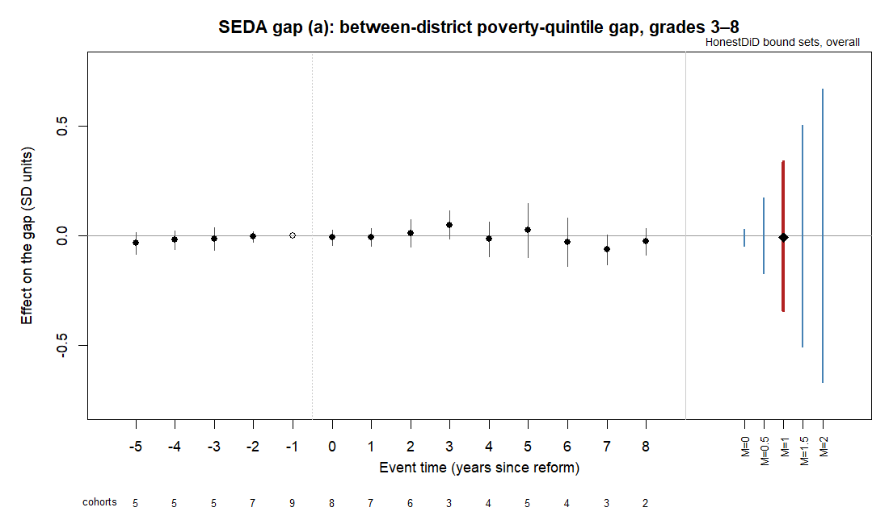
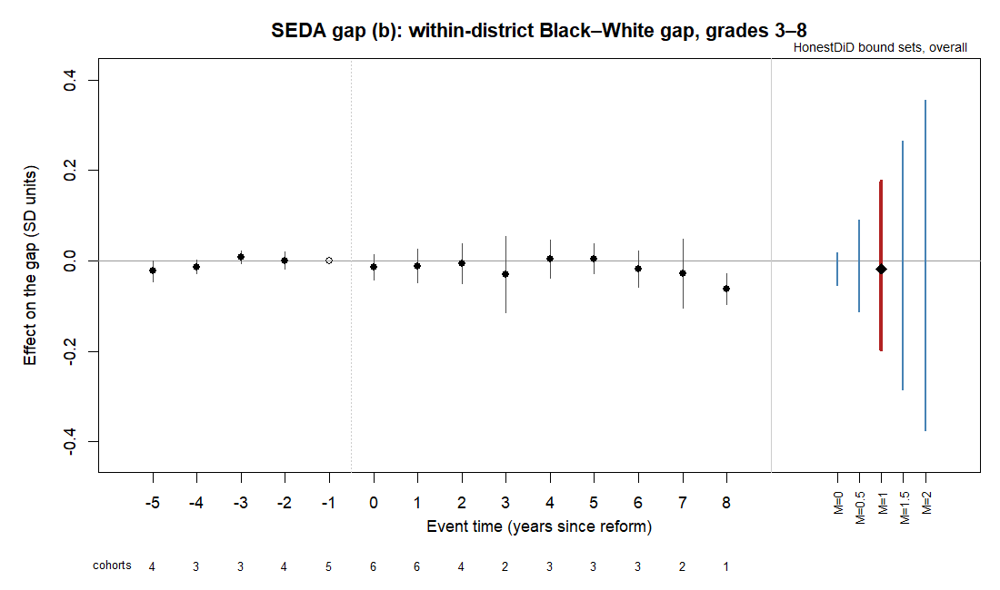
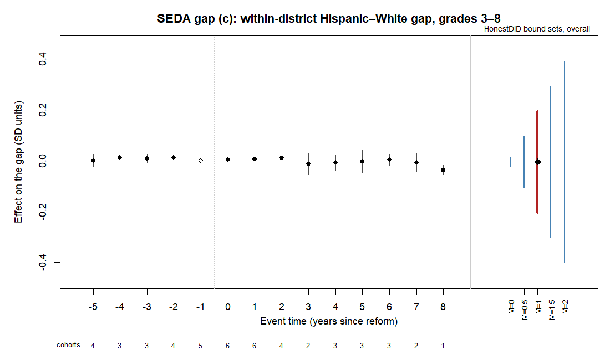
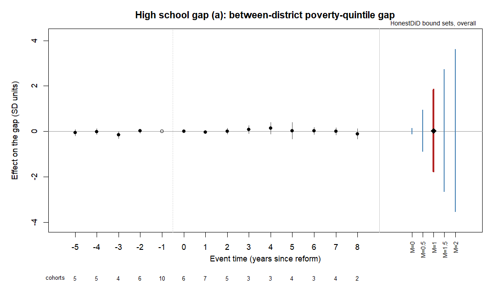
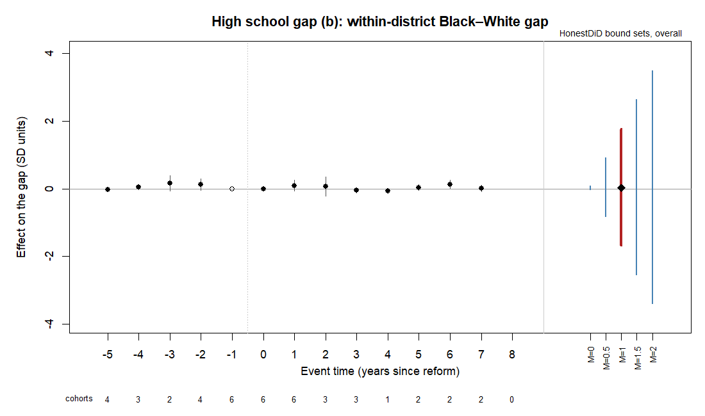
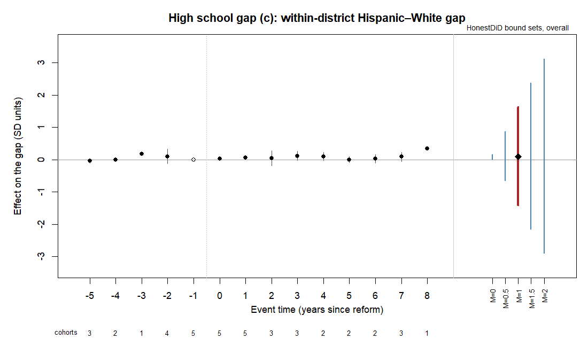

# Run 2 report (Section 12)

Run 20260917T041717Z; blinding status **REAL**. Run 2 is the registered extension (docs/design_extension.md); Run 1 is the registered study and is reported first.

Run 1 Section 13 applies to each Run 2 outcome family. For each gap the honest-DiD bound sets come first; the headline is the bound set at M̄ = 1, and all five M̄ values are shown. Point estimates, p-values and intervals are reported as quantities, and no result is described as statistically significant.

Primary specification: Callaway–Sant'Anna, not-yet-treated controls, doubly robust, unbalanced panel, primary suppression sample (high school), reference period −1, primary event set, unweighted; the high school models take no source covariate (post-freeze correction 2026-09-17). Treated-unit floor (post-freeze correction 2026-09-18, Section 7): in gaps (b) and (c), whose models adjust for the 2009 covariates, a cohort with fewer than 20 treated units at its base period in the primary model's panel is left out of every Callaway–Sant'Anna model of its gap and event set and fitted without covariates in appendix/thin_cohorts.csv (listed at the end of this report). In the event-study tables, † marks a coefficient resting on a single treated state. Event-time and overall intervals are Webb wild cluster bootstrap intervals (9,999 draws, state clusters).

## Answer to the research question, by family and gap

| family | gap | sd_interval_mbar1 | per_1000_interval |
|---|---|---|---|
| seda | a_poverty | [-0.341, 0.341] | unbounded (the revenue effect's bootstrap interval includes zero) |
| seda | b_black_white | [-0.197, 0.176] | unbounded (the revenue effect's bootstrap interval includes zero) |
| seda | c_hispanic_white | [-0.206, 0.196] | unbounded (the revenue effect's bootstrap interval includes zero) |
| hs | a_poverty | [-1.768, 1.847] | unbounded (the revenue effect's bootstrap interval includes zero) |
| hs | b_black_white | [-1.682, 1.774] | unbounded (the revenue effect's bootstrap interval includes zero) |
| hs | c_hispanic_white | [-1.413, 1.630] | unbounded (the revenue effect's bootstrap interval includes zero) |

# SEDA grades 3–8 gaps (end years 2009–2019 and 2022–2025)

Outcome units: national standard deviation units (SEDA cohort-standardized scale).

## SEDA gap (a): between-district poverty-quintile gap, grades 3–8

### 1. Honest-DiD bound sets (relative magnitudes, overall post-reform average)

Each M̄ starts on HonestDiD's default grid (±20 standard deviations of the overall estimate, 1,000 points), widened on a side its bound set reaches. Where the estimated event times are not consecutive around the reference period, the bound sets are computed on the largest consecutive block through the reference period and event time 0 (the block rule), named in the event_block column.

| M̄ | lower | upper | width | status | grid | headline |
|---|---|---|---|---|---|---|
| original CS (no restriction) | -0.046 | 0.032 | 0.078 | ok | – |  |
| 0 | -0.046 | 0.031 | 0.077 | ok | [-0.397, 0.397], 1000 points |  |
| 0.5 | -0.174 | 0.174 | 0.348 | ok | [-0.397, 0.397], 1000 points |  |
| 1 | -0.341 | 0.341 | 0.682 | ok | [-0.397, 0.397], 1000 points | **headline** |
| 1.5 | -0.506 | 0.506 | 1.012 | ok | [-1.192, 1.192], 2998 points |  |
| 2 | -0.670 | 0.670 | 1.339 | ok | [-1.192, 1.192], 2998 points |  |

### 2. Event study with honest-DiD bounds and cohorts per coefficient

| event_time | estimate | boot_ci | boot_p | cohorts | treated_states | treated_units | reference |
|---|---|---|---|---|---|---|---|
| -5 | -0.034 | [-0.084, 0.017] | 0.2169 | 5 |  6 |  6 |  |
| -4 | -0.020 | [-0.061, 0.022] | 0.4037 | 5 |  6 |  6 |  |
| -3 | -0.014 | [-0.066, 0.038] | 0.6359 | 5 |  7 |  7 |  |
| -2 | -0.005 | [-0.028, 0.018] | 0.6942 | 7 |  8 |  8 |  |
| -1 | 0.000 | – | – | 9 | 10 | 10 | ref |
|  0 | -0.007 | [-0.042, 0.027] | 0.6941 | 8 | 10 | 10 |  |
|  1 | -0.008 | [-0.049, 0.032] | 0.7041 | 7 |  8 |  8 |  |
|  2 | 0.013 | [-0.050, 0.076] | 0.7076 | 6 |  7 |  7 |  |
|  3 | 0.049 | [-0.016, 0.115] | 0.1493 | 3 |  4 |  4 |  |
|  4 | -0.015 | [-0.095, 0.064] | 0.7108 | 4 |  4 |  4 |  |
|  5 | 0.025 | [-0.099, 0.148] | 0.7018 | 5 |  5 |  5 |  |
|  6 | -0.029 | [-0.138, 0.080] | 0.6719 | 4 |  4 |  4 |  |
|  7 | -0.064 | [-0.131, 0.004] | 0.0709 | 3 |  3 |  3 |  |
|  8 | -0.027 | [-0.087, 0.033] | 0.4009 | 2 |  2 |  2 |  |

### 3. Overall post-reform average

| estimate | clustered_se | boot_ci | boot_p | randomization_p | randomization_reps | romano_wolf_p | cohorts | treated_states | model_status |
|---|---|---|---|---|---|---|---|---|---|
| -0.007 | 0.020 | [-0.046, 0.032] | 0.7218 | 0.8439 | 10000 | 0.8769 | 9 | 11 | ok |

### 4. Dose-scaled estimate (per $1,000 of per-pupil state-plus-local revenue, 2025 dollars)

Revenue effect: the same Callaway–Sant'Anna model with F-33 (TSTREV + TLOCREV) / V33 in thousands of 2025 dollars as the outcome, fiscal years 2010–2024 (quintile 5 minus quintile 1 membership-weighted revenue per pupil over a district set fixed across fiscal years, as step 13's gap (a) treatment). District-years with F-33 enrollment below 30 or revenue above $100,000 per pupil are excluded: 433 of the 43927 district-years in scope (397 below 30 enrolled, 72 above $100,000). The dose-scaled estimate is the ratio of the two overall effects, with a percentile interval from this run's step 7 Webb draws applied to both. **Assumption:** the reform affects the gap only through revenue (exclusion restriction). The assumption is stated, not tested.

| effect_sd | revenue_effect | revenue_boot_ci | sd_per_1000 | interval_per_1000 | status |
|---|---|---|---|---|---|
| -0.007 | 0.140 | [-0.616, 0.899] | -0.051 | unbounded or none | unbounded: the revenue effect's bootstrap interval includes zero |

### 5. Lee bounds

Not computed for the SEDA gaps: step 14 computes Lee bounds for the high school gaps (b) and (c).

### 6. Estimator agreement (unbalanced panel, primary event set)

Secondary intervals are each estimator's own state-clustered or placebo interval; the stacked regression averages event times 0..+5; two-way fixed effects rows are for comparison only. Controls: CEP.

| estimator | estimate | se | ci | status |
|---|---|---|---|---|
| callaway_santanna (primary) | -0.007 | 0.020 | [-0.046, 0.032] | ok |
| sun_abraham | -0.015 | 0.010 | [-0.034, 0.005] | ok |
| imputation | 0.000 | 0.015 | [-0.029, 0.029] | ok |
| synthdid | -0.014 | 0.052 | [-0.117, 0.088] | ok |
| stacked | -0.002 | 0.017 | [-0.035, 0.031] | ok |
| twfe | -0.020 | 0.020 | [-0.060, 0.020] | ok |
| twfe_static | 0.008 | 0.025 | [-0.041, 0.057] | ok |

### 7. Weighted comparison

Gap (a) is a state-level outcome and has no weighted version (Run 1 Section 7).

### 8. Narrower event definitions

r1 = LRS list plus final state supreme court rulings; r2 = court rulings only.

| event_set | estimate | boot_ci | boot_p | randomization_p | bound_mbar1 | sd_per_1000 | status |
|---|---|---|---|---|---|---|---|
| primary | -0.007 | [-0.046, 0.032] | 0.7218 | 0.8439 | [-0.341, 0.341] | -0.051 | ok |
| r1 | -0.023 | [-0.056, 0.009] | 0.1724 | 0.5894 | [-0.197, 0.121] | 0.211 | ok |
| r2 | -0.049 | [-0.075, -0.024] | 0.0001 | 0.2705 | [-0.049, 0.094] (event times -2..+2) | -0.146 | ok |

### 9. Run 1 robustness checks (primary event set, unweighted)

Variants on all three event sets and both weightings, with event times, Romano–Wolf families and every M̄: outputs/run2/14_run_all/seda/variants. Randomization inference uses 1,000 reassignments on the variants (Section 8); the suppression samples and the end-years-2013 variant do not apply to SEDA (Section 10).

| check | estimate | boot_p | randomization_p | randomization_reps | bound_mbar1 | status |
|---|---|---|---|---|---|---|
| Balanced panel (Run 1 Section 7) | -0.000 | 0.9731 | 0.9929 | 10000 | [-0.405, 0.389] (event times -3..+7) | ok |
| Cohorts with fewer than three pre-reform years dropped (Run 1 Section 5 rule 6) | 0.002 | 0.9353 | 0.9560 |  1000 | [-0.333, 0.348] | ok |
| Anticipation = 1, reference period -2 (Run 1 step 10) | -0.000 | 0.9877 | 0.9920 |  1000 | [-0.346, 0.353] | ok |

### 10. Run 2 splits (Section 10; primary event set, unweighted)

SEDA's 2022–2025 estimates come from public suppressed state data rather than the restricted-use counts behind 2009–2019; each span is rerun alone, with cohorts coded over its own years.

| check | estimate | boot_p | randomization_p | randomization_reps | bound_mbar1 | status |
|---|---|---|---|---|---|---|
| Full SEDA window, 2009–2019 and 2022–2025 (primary specification) | -0.007 | 0.7218 | 0.8439 | 10000 | [-0.341, 0.341] | ok |
| SEDA 2009-2019 alone (Section 10 span split) | -0.043 | 0.0237 | 0.3237 |  1000 | [-0.576, 0.486] | ok |
| SEDA 2022-2025 alone (Section 10 span split) | -0.018 | 0.4010 | 0.6543 |  1000 | [-0.238, 0.211] | ok |

### 11. Continuous-treatment estimates (exploratory; step 13, DIDmultiplegtDYN)

Treatment: binned real revenue per pupil (bin_1000 primary, bin_2000 sensitivity), a discrete treatment; effects at event times 0..+8 and placebos at −2..−6, reference −1; an effect or placebo with fewer than 20 stayers or stayers in fewer than 3 states is not estimable. **Caveat:** Analytical standard errors clustered by state (DIDmultiplegtDYN 2.4.0), no bootstrap. The package's caveat that analytical errors "can be liberal" applies to its continuous option, which is not used: the binned revenue enters as a discrete treatment. No covariate controls (memory). Exploratory estimator.

| bin | units_with_outcome | switchers_used | switchers_dropped_no_stayer_in_bin | estimation |
|---|---|---|---|---|
| bin_1000 | 37 | 23 | 8 | ok |
| bin_2000 | 37 | 22 | 3 | ok |

| bin | type | package_label | event_time | estimate | se | ci | switchers | stayers | stayer_states | status |
|---|---|---|---|---|---|---|---|---|---|---|
| bin_1000 | placebo | Placebo_5 | -6 | – | – | – |  1 |  1 |  1 | not estimable: 1 stayers in 1 states (need 20 in 3) |
| bin_1000 | placebo | Placebo_4 | -5 | – | – | – |  3 |  4 |  4 | not estimable: 4 stayers in 4 states (need 20 in 3) |
| bin_1000 | placebo | Placebo_3 | -4 | – | – | – |  4 |  6 |  6 | not estimable: 6 stayers in 6 states (need 20 in 3) |
| bin_1000 | placebo | Placebo_2 | -3 | – | – | – |  7 |  9 |  9 | not estimable: 9 stayers in 9 states (need 20 in 3) |
| bin_1000 | placebo | Placebo_1 | -2 | – | – | – | 16 | 14 | 14 | not estimable: 14 stayers in 14 states (need 20 in 3) |
| bin_1000 | effect | Effect_1 |  0 | -0.005 | 0.011 | [-0.025, 0.016] | 23 | 22 | 22 | ok |
| bin_1000 | effect | Effect_2 |  1 | – | – | – | 19 | 16 | 16 | not estimable: 16 stayers in 16 states (need 20 in 3) |
| bin_1000 | effect | Effect_3 |  2 | – | – | – | 17 | 13 | 13 | not estimable: 13 stayers in 13 states (need 20 in 3) |
| bin_1000 | effect | Effect_4 |  3 | – | – | – | 12 |  9 |  9 | not estimable: 9 stayers in 9 states (need 20 in 3) |
| bin_1000 | effect | Effect_5 |  4 | – | – | – | 13 |  8 |  8 | not estimable: 8 stayers in 8 states (need 20 in 3) |
| bin_1000 | effect | Effect_6 |  5 | – | – | – | 11 |  7 |  7 | not estimable: 7 stayers in 7 states (need 20 in 3) |
| bin_1000 | effect | Effect_7 |  6 | – | – | – | 10 |  6 |  6 | not estimable: 6 stayers in 6 states (need 20 in 3) |
| bin_1000 | effect | Effect_8 |  7 | – | – | – |  6 |  4 |  4 | not estimable: 4 stayers in 4 states (need 20 in 3) |
| bin_1000 | effect | Effect_9 |  8 | – | – | – |  4 |  4 |  4 | not estimable: 4 stayers in 4 states (need 20 in 3) |
| bin_2000 | placebo | Placebo_5 | -6 | – | – | – |  5 |  8 |  8 | not estimable: 8 stayers in 8 states (need 20 in 3) |
| bin_2000 | placebo | Placebo_4 | -5 | – | – | – |  6 | 10 | 10 | not estimable: 10 stayers in 10 states (need 20 in 3) |
| bin_2000 | placebo | Placebo_3 | -4 | – | – | – |  3 | 12 | 12 | not estimable: 12 stayers in 12 states (need 20 in 3) |
| bin_2000 | placebo | Placebo_2 | -3 | – | – | – |  8 | 19 | 19 | not estimable: 19 stayers in 19 states (need 20 in 3) |
| bin_2000 | placebo | Placebo_1 | -2 | 0.001 | 0.015 | [-0.029, 0.030] | 15 | 22 | 22 | ok |
| bin_2000 | effect | Effect_1 |  0 | 0.005 | 0.008 | [-0.011, 0.021] | 21 | 26 | 26 | ok |
| bin_2000 | effect | Effect_2 |  1 | 0.020 | 0.011 | [-0.003, 0.042] | 18 | 22 | 22 | ok |
| bin_2000 | effect | Effect_3 |  2 | 0.013 | 0.019 | [-0.025, 0.051] | 13 | 20 | 20 | ok |
| bin_2000 | effect | Effect_4 |  3 | – | – | – | 12 | 18 | 18 | not estimable: 18 stayers in 18 states (need 20 in 3) |
| bin_2000 | effect | Effect_5 |  4 | – | – | – | 16 | 18 | 18 | not estimable: 18 stayers in 18 states (need 20 in 3) |
| bin_2000 | effect | Effect_6 |  5 | – | – | – | 15 | 16 | 16 | not estimable: 16 stayers in 16 states (need 20 in 3) |
| bin_2000 | effect | Effect_7 |  6 | – | – | – | 14 | 15 | 15 | not estimable: 15 stayers in 15 states (need 20 in 3) |
| bin_2000 | effect | Effect_8 |  7 | – | – | – |  8 | 12 | 12 | not estimable: 12 stayers in 12 states (need 20 in 3) |
| bin_2000 | effect | Effect_9 |  8 | – | – | – |  6 | 10 | 10 | not estimable: 10 stayers in 10 states (need 20 in 3) |

### Answer, stated as intervals

SD units: honest-DiD bound set at M̄ = 1, [-0.341, 0.341]. Per $1,000 of per-pupil revenue (2025 dollars): unbounded (the revenue effect's bootstrap interval includes zero) (percentile interval of the dose-scaled ratio; the first interval rests on bounded departures from parallel trends, the second on parallel trends and the exclusion restriction).

## SEDA gap (b): within-district Black–White gap, grades 3–8

### 1. Honest-DiD bound sets (relative magnitudes, overall post-reform average)

Each M̄ starts on HonestDiD's default grid (±20 standard deviations of the overall estimate, 1,000 points), widened on a side its bound set reaches. Where the estimated event times are not consecutive around the reference period, the bound sets are computed on the largest consecutive block through the reference period and event time 0 (the block rule), named in the event_block column.

| M̄ | lower | upper | width | status | grid | headline |
|---|---|---|---|---|---|---|
| original CS (no restriction) | -0.055 | 0.019 | 0.073 | ok | – |  |
| 0 | -0.055 | 0.018 | 0.073 | ok | [-0.374, 0.374], 1000 points |  |
| 0.5 | -0.113 | 0.090 | 0.204 | ok | [-0.374, 0.374], 1000 points |  |
| 1 | -0.197 | 0.176 | 0.373 | ok | [-0.374, 0.374], 1000 points | **headline** |
| 1.5 | -0.286 | 0.265 | 0.550 | ok | [-0.374, 0.374], 1000 points |  |
| 2 | -0.375 | 0.354 | 0.730 | ok | [-1.121, 0.374], 1999 points |  |

### 2. Event study with honest-DiD bounds and cohorts per coefficient

| event_time | estimate | boot_ci | boot_p | cohorts | treated_states | treated_units | reference |
|---|---|---|---|---|---|---|---|
| -5 | -0.023 | [-0.046, -0.001] | 0.0414 | 4 | 5 | 532 |  |
| -4 | -0.014 | [-0.028, 0.001] | 0.0671 | 3 | 4 | 380 |  |
| -3 | 0.007 | [-0.007, 0.021] | 0.3643 | 3 | 4 | 371 |  |
| -2 | 0.001 | [-0.019, 0.020] | 0.9350 | 4 | 4 | 420 |  |
| -1 | 0.000 | – | – | 5 | 5 | 501 | ref |
|  0 | -0.014 | [-0.043, 0.014] | 0.3377 | 6 | 7 | 648 |  |
|  1 | -0.012 | [-0.049, 0.025] | 0.5399 | 6 | 7 | 648 |  |
|  2 | -0.006 | [-0.051, 0.038] | 0.8406 | 4 | 5 | 344 |  |
|  3 | -0.031 | [-0.115, 0.053] | 0.5132 | 2 | 3 | 219 |  |
|  4 | 0.004 | [-0.039, 0.046] | 0.8522 | 3 | 3 | 268 |  |
|  5 | 0.005 | [-0.029, 0.039] | 0.8428 | 3 | 3 | 268 |  |
|  6 | -0.018 | [-0.058, 0.022] | 0.4373 | 3 | 3 | 268 |  |
|  7 | -0.028 | [-0.104, 0.049] | 0.5192 | 2 | 2 | 116 |  |
|  8 | -0.062 † | [-0.096, -0.028] | 0.0001 | 1 | 1 |  44 |  |

† The coefficient rests on a single treated state.
### 3. Overall post-reform average

| estimate | clustered_se | boot_ci | boot_p | randomization_p | randomization_reps | romano_wolf_p | cohorts | treated_states | model_status |
|---|---|---|---|---|---|---|---|---|---|
| -0.018 | 0.019 | [-0.054, 0.017] | 0.3503 | 0.5652 | 10000 | 0.6757 | 6 | 7 | ok |

### 4. Dose-scaled estimate (per $1,000 of per-pupil state-plus-local revenue, 2025 dollars)

Revenue effect: the same Callaway–Sant'Anna model with F-33 (TSTREV + TLOCREV) / V33 in thousands of 2025 dollars as the outcome, fiscal years 2010–2024 (district revenue per pupil). District-years with F-33 enrollment below 30 or revenue above $100,000 per pupil are excluded: 7 of the 26381 district-years in scope (0 below 30 enrolled, 7 above $100,000). The dose-scaled estimate is the ratio of the two overall effects, with a percentile interval from this run's step 7 Webb draws applied to both. **Assumption:** the reform affects the gap only through revenue (exclusion restriction). The assumption is stated, not tested.

| effect_sd | revenue_effect | revenue_boot_ci | sd_per_1000 | interval_per_1000 | status |
|---|---|---|---|---|---|
| -0.018 | 0.534 | [-0.068, 1.147] | -0.034 | unbounded or none | unbounded: the revenue effect's bootstrap interval includes zero |

### 5. Lee bounds

Not computed for the SEDA gaps: step 14 computes Lee bounds for the high school gaps (b) and (c).

### 6. Estimator agreement (unbalanced panel, primary event set)

Secondary intervals are each estimator's own state-clustered or placebo interval; the stacked regression averages event times 0..+5; two-way fixed effects rows are for comparison only. Controls: CEP, and the 2009 covariates by year.

| estimator | estimate | se | ci | status |
|---|---|---|---|---|
| callaway_santanna (primary) | -0.018 | 0.019 | [-0.054, 0.017] | ok |
| sun_abraham | 0.008 | 0.007 | [-0.006, 0.022] | ok |
| imputation | 0.005 | 0.008 | [-0.012, 0.021] | ok |
| synthdid | 0.086 | 0.044 | [0.000, 0.173] | ok |
| stacked | -0.003 | 0.014 | [-0.030, 0.023] | ok |
| twfe | -0.008 | 0.013 | [-0.034, 0.017] | ok |
| twfe_static | 0.010 | 0.014 | [-0.018, 0.038] | ok |

### 7. Weighted comparison

tested_weighted: SEDA's tot_asmt of the gap's two groups in 2009-10, summed over grades 3-8, mean of math and RLA, fixed. units = treated units behind the overall average.

| weighting | estimate | boot_p | randomization_p | bound_mbar1 | units | status |
|---|---|---|---|---|---|---|
| unweighted | -0.018 | 0.3503 | 0.5652 | [-0.197, 0.176] | 648 | ok |
| tested_weighted | -0.014 | 0.2557 | 0.6726 | [-0.205, 0.175] | 489 | ok |

### 8. Narrower event definitions

r1 = LRS list plus final state supreme court rulings; r2 = court rulings only.

| event_set | estimate | boot_ci | boot_p | randomization_p | bound_mbar1 | sd_per_1000 | status |
|---|---|---|---|---|---|---|---|
| primary | -0.018 | [-0.054, 0.017] | 0.3503 | 0.5652 | [-0.197, 0.176] | -0.034 | ok |
| r1 | -0.003 | [-0.050, 0.044] | 0.8914 | 0.9286 | [-0.201, 0.154] | -0.008 | ok |
| r2 | -0.068 | [-0.087, -0.049] | 0.0001 | 0.1179 | [-0.066, 0.014] (event times -2..+2) | -0.074 | ok |

### 9. Run 1 robustness checks (primary event set, unweighted)

Variants on all three event sets and both weightings, with event times, Romano–Wolf families and every M̄: outputs/run2/14_run_all/seda/variants. Randomization inference uses 1,000 reassignments on the variants (Section 8); the suppression samples and the end-years-2013 variant do not apply to SEDA (Section 10).

| check | estimate | boot_p | randomization_p | randomization_reps | bound_mbar1 | status |
|---|---|---|---|---|---|---|
| Balanced panel (Run 1 Section 7) | 0.027 | 0.0611 | 0.6377 | 10000 | [-0.261, 0.301] (event times -3..+7) | ok |
| Cohorts with fewer than three pre-reform years dropped (Run 1 Section 5 rule 6) | -0.000 | 0.9790 | 0.9890 |  1000 | [-0.165, 0.170] | ok |
| Anticipation = 1, reference period -2 (Run 1 step 10) | -0.017 | 0.4372 | 0.6304 |  1000 | [-0.255, 0.247] | ok |

### 10. Run 2 splits (Section 10; primary event set, unweighted)

SEDA's 2022–2025 estimates come from public suppressed state data rather than the restricted-use counts behind 2009–2019; each span is rerun alone, with cohorts coded over its own years.

| check | estimate | boot_p | randomization_p | randomization_reps | bound_mbar1 | status |
|---|---|---|---|---|---|---|
| Full SEDA window, 2009–2019 and 2022–2025 (primary specification) | -0.018 | 0.3503 | 0.5652 | 10000 | [-0.197, 0.176] | ok |
| SEDA 2009-2019 alone (Section 10 span split) | -0.002 | 0.9238 | 0.9398 |  1000 | [-0.234, 0.250] | ok |
| SEDA 2022-2025 alone (Section 10 span split) | 0.001 | 0.9510 | 0.9719 |  1000 | [-0.074, 0.072] | ok |

### 11. Continuous-treatment estimates (exploratory; step 13, DIDmultiplegtDYN)

Treatment: binned real revenue per pupil (bin_1000 primary, bin_2000 sensitivity), a discrete treatment; effects at event times 0..+8 and placebos at −2..−6, reference −1; an effect or placebo with fewer than 20 stayers or stayers in fewer than 3 states is not estimable. **Caveat:** Analytical standard errors clustered by state (DIDmultiplegtDYN 2.4.0), no bootstrap. The package's caveat that analytical errors "can be liberal" applies to its continuous option, which is not used: the binned revenue enters as a discrete treatment. No covariate controls (memory). Exploratory estimator.

| bin | units_with_outcome | switchers_used | switchers_dropped_no_stayer_in_bin | estimation |
|---|---|---|---|---|
| bin_1000 | 2135 | 1697 | 44 | ok |
| bin_2000 | 2135 | 1587 | 19 | ok |

| bin | type | package_label | event_time | estimate | se | ci | switchers | stayers | stayer_states | status |
|---|---|---|---|---|---|---|---|---|---|---|
| bin_1000 | placebo | Placebo_5 | -6 | – | – | – |    3 |    2 |  2 | not estimable: 2 stayers in 2 states (need 20 in 3) |
| bin_1000 | placebo | Placebo_4 | -5 | 0.038 | 0.037 | [-0.035, 0.110] |   94 |   24 | 10 | ok |
| bin_1000 | placebo | Placebo_3 | -4 | 0.025 | 0.014 | [-0.003, 0.052] |  162 |   52 | 13 | ok |
| bin_1000 | placebo | Placebo_2 | -3 | 0.006 | 0.007 | [-0.007, 0.019] |  322 |  179 | 20 | ok |
| bin_1000 | placebo | Placebo_1 | -2 | -0.008 | 0.005 | [-0.018, 0.002] |  679 |  447 | 28 | ok |
| bin_1000 | effect | Effect_1 |  0 | 0.002 | 0.003 | [-0.004, 0.007] | 1639 |  793 | 35 | ok |
| bin_1000 | effect | Effect_2 |  1 | 0.002 | 0.006 | [-0.009, 0.013] | 1515 |  453 | 28 | ok |
| bin_1000 | effect | Effect_3 |  2 | 0.004 | 0.006 | [-0.007, 0.016] | 1331 |  281 | 23 | ok |
| bin_1000 | effect | Effect_4 |  3 | 0.010 | 0.008 | [-0.006, 0.027] | 1120 |  189 | 20 | ok |
| bin_1000 | effect | Effect_5 |  4 | 0.001 | 0.009 | [-0.017, 0.018] | 1013 |  114 | 16 | ok |
| bin_1000 | effect | Effect_6 |  5 | 0.001 | 0.011 | [-0.020, 0.022] |  814 |   56 | 13 | ok |
| bin_1000 | effect | Effect_7 |  6 | -0.001 | 0.012 | [-0.025, 0.023] |  621 |   40 | 12 | ok |
| bin_1000 | effect | Effect_8 |  7 | -0.019 | 0.020 | [-0.058, 0.020] |  425 |   24 | 10 | ok |
| bin_1000 | effect | Effect_9 |  8 | – | – | – |  364 |   12 |  7 | not estimable: 12 stayers in 7 states (need 20 in 3) |
| bin_2000 | placebo | Placebo_5 | -6 | -0.001 | 0.033 | [-0.066, 0.064] |   90 |   43 | 13 | ok |
| bin_2000 | placebo | Placebo_4 | -5 | -0.005 | 0.010 | [-0.026, 0.015] |  230 |  209 | 21 | ok |
| bin_2000 | placebo | Placebo_3 | -4 | 0.002 | 0.007 | [-0.010, 0.015] |  352 |  336 | 26 | ok |
| bin_2000 | placebo | Placebo_2 | -3 | -0.010 | 0.009 | [-0.029, 0.009] |  520 |  552 | 29 | ok |
| bin_2000 | placebo | Placebo_1 | -2 | -0.008 | 0.004 | [-0.015, -0.001] |  841 |  882 | 32 | ok |
| bin_2000 | effect | Effect_1 |  0 | -0.007 | 0.003 | [-0.013, -0.001] | 1497 | 1173 | 36 | ok |
| bin_2000 | effect | Effect_2 |  1 | -0.006 | 0.004 | [-0.014, 0.002] | 1379 |  895 | 33 | ok |
| bin_2000 | effect | Effect_3 |  2 | -0.004 | 0.005 | [-0.014, 0.006] | 1247 |  714 | 32 | ok |
| bin_2000 | effect | Effect_4 |  3 | -0.004 | 0.006 | [-0.016, 0.008] | 1150 |  575 | 29 | ok |
| bin_2000 | effect | Effect_5 |  4 | -0.005 | 0.007 | [-0.018, 0.009] | 1107 |  451 | 26 | ok |
| bin_2000 | effect | Effect_6 |  5 | 0.002 | 0.010 | [-0.017, 0.022] |  961 |  344 | 26 | ok |
| bin_2000 | effect | Effect_7 |  6 | 0.004 | 0.011 | [-0.018, 0.025] |  870 |  276 | 23 | ok |
| bin_2000 | effect | Effect_8 |  7 | -0.007 | 0.015 | [-0.037, 0.022] |  751 |  218 | 21 | ok |
| bin_2000 | effect | Effect_9 |  8 | -0.012 | 0.016 | [-0.043, 0.019] |  615 |  160 | 19 | ok |

### Answer, stated as intervals

SD units: honest-DiD bound set at M̄ = 1, [-0.197, 0.176]. Per $1,000 of per-pupil revenue (2025 dollars): unbounded (the revenue effect's bootstrap interval includes zero) (percentile interval of the dose-scaled ratio; the first interval rests on bounded departures from parallel trends, the second on parallel trends and the exclusion restriction).

## SEDA gap (c): within-district Hispanic–White gap, grades 3–8

### 1. Honest-DiD bound sets (relative magnitudes, overall post-reform average)

Each M̄ starts on HonestDiD's default grid (±20 standard deviations of the overall estimate, 1,000 points), widened on a side its bound set reaches. Where the estimated event times are not consecutive around the reference period, the bound sets are computed on the largest consecutive block through the reference period and event time 0 (the block rule), named in the event_block column.

| M̄ | lower | upper | width | status | grid | headline |
|---|---|---|---|---|---|---|
| original CS (no restriction) | -0.025 | 0.015 | 0.040 | ok | – |  |
| 0 | -0.025 | 0.015 | 0.040 | ok | [-0.206, 0.206], 1000 points |  |
| 0.5 | -0.108 | 0.097 | 0.205 | ok | [-0.206, 0.206], 1000 points |  |
| 1 | -0.206 | 0.196 | 0.402 | ok | [-0.617, 0.206], 1999 points | **headline** |
| 1.5 | -0.303 | 0.293 | 0.597 | ok | [-0.617, 0.617], 2998 points |  |
| 2 | -0.401 | 0.391 | 0.792 | ok | [-0.617, 0.617], 2998 points |  |

### 2. Event study with honest-DiD bounds and cohorts per coefficient

| event_time | estimate | boot_ci | boot_p | cohorts | treated_states | treated_units | reference |
|---|---|---|---|---|---|---|---|
| -5 | 0.000 | [-0.025, 0.025] | 0.9971 | 4 | 5 | 622 |  |
| -4 | 0.012 | [-0.021, 0.045] | 0.5424 | 3 | 4 | 446 |  |
| -3 | 0.009 | [-0.008, 0.026] | 0.3566 | 3 | 4 | 493 |  |
| -2 | 0.013 | [-0.013, 0.039] | 0.4404 | 4 | 4 | 670 |  |
| -1 | 0.000 | – | – | 5 | 5 | 742 | ref |
|  0 | 0.005 | [-0.015, 0.024] | 0.6729 | 6 | 7 | 882 |  |
|  1 | 0.006 | [-0.018, 0.029] | 0.6783 | 6 | 7 | 882 |  |
|  2 | 0.011 | [-0.016, 0.037] | 0.4617 | 4 | 5 | 472 |  |
|  3 | -0.013 | [-0.054, 0.029] | 0.5645 | 2 | 3 | 259 |  |
|  4 | -0.008 | [-0.038, 0.023] | 0.6462 | 3 | 3 | 494 |  |
|  5 | -0.003 | [-0.046, 0.040] | 0.9182 | 3 | 3 | 494 |  |
|  6 | 0.003 | [-0.019, 0.025] | 0.8193 | 3 | 3 | 494 |  |
|  7 | -0.007 | [-0.042, 0.029] | 0.7308 | 2 | 2 | 260 |  |
|  8 | -0.037 † | [-0.055, -0.019] | 0.0001 | 1 | 1 | 141 |  |

† The coefficient rests on a single treated state.
### 3. Overall post-reform average

| estimate | clustered_se | boot_ci | boot_p | randomization_p | randomization_reps | romano_wolf_p | cohorts | treated_states | model_status |
|---|---|---|---|---|---|---|---|---|---|
| -0.005 | 0.010 | [-0.025, 0.015] | 0.6446 | 0.8538 | 10000 | 0.8769 | 6 | 7 | ok |

### 4. Dose-scaled estimate (per $1,000 of per-pupil state-plus-local revenue, 2025 dollars)

Revenue effect: the same Callaway–Sant'Anna model with F-33 (TSTREV + TLOCREV) / V33 in thousands of 2025 dollars as the outcome, fiscal years 2010–2024 (district revenue per pupil). District-years with F-33 enrollment below 30 or revenue above $100,000 per pupil are excluded: 9 of the 37383 district-years in scope (0 below 30 enrolled, 9 above $100,000). The dose-scaled estimate is the ratio of the two overall effects, with a percentile interval from this run's step 7 Webb draws applied to both. **Assumption:** the reform affects the gap only through revenue (exclusion restriction). The assumption is stated, not tested.

| effect_sd | revenue_effect | revenue_boot_ci | sd_per_1000 | interval_per_1000 | status |
|---|---|---|---|---|---|
| -0.005 | 0.533 | [-0.120, 1.198] | -0.009 | unbounded or none | unbounded: the revenue effect's bootstrap interval includes zero |

### 5. Lee bounds

Not computed for the SEDA gaps: step 14 computes Lee bounds for the high school gaps (b) and (c).

### 6. Estimator agreement (unbalanced panel, primary event set)

Secondary intervals are each estimator's own state-clustered or placebo interval; the stacked regression averages event times 0..+5; two-way fixed effects rows are for comparison only. Controls: CEP, and the 2009 covariates by year.

| estimator | estimate | se | ci | status |
|---|---|---|---|---|
| callaway_santanna (primary) | -0.005 | 0.010 | [-0.025, 0.015] | ok |
| sun_abraham | 0.010 | 0.006 | [-0.001, 0.022] | ok |
| imputation | 0.010 | 0.008 | [-0.005, 0.025] | ok |
| synthdid | 0.049 | 0.033 | [-0.015, 0.113] | ok |
| stacked | 0.017 | 0.007 | [0.002, 0.032] | ok |
| twfe | 0.011 | 0.009 | [-0.007, 0.030] | ok |
| twfe_static | 0.017 | 0.011 | [-0.004, 0.038] | ok |

### 7. Weighted comparison

tested_weighted: SEDA's tot_asmt of the gap's two groups in 2009-10, summed over grades 3-8, mean of math and RLA, fixed. units = treated units behind the overall average.

| weighting | estimate | boot_p | randomization_p | bound_mbar1 | units | status |
|---|---|---|---|---|---|---|
| unweighted | -0.005 | 0.6446 | 0.8538 | [-0.206, 0.196] | 882 | ok |
| tested_weighted | 0.001 | 0.9289 | 0.9678 | [-0.454, 0.447] | 502 | ok |

### 8. Narrower event definitions

r1 = LRS list plus final state supreme court rulings; r2 = court rulings only.

| event_set | estimate | boot_ci | boot_p | randomization_p | bound_mbar1 | sd_per_1000 | status |
|---|---|---|---|---|---|---|---|
| primary | -0.005 | [-0.025, 0.015] | 0.6446 | 0.8538 | [-0.206, 0.196] | -0.009 | ok |
| r1 | -0.000 | [-0.020, 0.020] | 0.9994 | 1.0000 | [-0.322, 0.343] | -0.000 | ok |
| r2 | -0.012 | [-0.024, -0.000] | 0.0442 | 0.7230 | [-0.047, 0.098] (event times -2..+2) | -0.017 | ok |

### 9. Run 1 robustness checks (primary event set, unweighted)

Variants on all three event sets and both weightings, with event times, Romano–Wolf families and every M̄: outputs/run2/14_run_all/seda/variants. Randomization inference uses 1,000 reassignments on the variants (Section 8); the suppression samples and the end-years-2013 variant do not apply to SEDA (Section 10).

| check | estimate | boot_p | randomization_p | randomization_reps | bound_mbar1 | status |
|---|---|---|---|---|---|---|
| Balanced panel (Run 1 Section 7) | 0.027 | 0.0001 | 0.2061 | 10000 | [-0.212, 0.264] (event times -3..+7) | ok |
| Cohorts with fewer than three pre-reform years dropped (Run 1 Section 5 rule 6) | 0.006 | 0.5311 | 0.8422 |  1000 | [-0.175, 0.190] | ok |
| Anticipation = 1, reference period -2 (Run 1 step 10) | -0.030 | 0.0022 | 0.3457 |  1000 | [-0.278, 0.212] | ok |

### 10. Run 2 splits (Section 10; primary event set, unweighted)

SEDA's 2022–2025 estimates come from public suppressed state data rather than the restricted-use counts behind 2009–2019; each span is rerun alone, with cohorts coded over its own years.

| check | estimate | boot_p | randomization_p | randomization_reps | bound_mbar1 | status |
|---|---|---|---|---|---|---|
| Full SEDA window, 2009–2019 and 2022–2025 (primary specification) | -0.005 | 0.6446 | 0.8538 | 10000 | [-0.206, 0.196] | ok |
| SEDA 2009-2019 alone (Section 10 span split) | -0.001 | 0.9412 | 0.9820 |  1000 | [-0.211, 0.231] | ok |
| SEDA 2022-2025 alone (Section 10 span split) | 0.017 | 0.3287 | 0.5546 |  1000 | [-0.079, 0.114] | ok |

### 11. Continuous-treatment estimates (exploratory; step 13, DIDmultiplegtDYN)

Treatment: binned real revenue per pupil (bin_1000 primary, bin_2000 sensitivity), a discrete treatment; effects at event times 0..+8 and placebos at −2..−6, reference −1; an effect or placebo with fewer than 20 stayers or stayers in fewer than 3 states is not estimable. **Caveat:** Analytical standard errors clustered by state (DIDmultiplegtDYN 2.4.0), no bootstrap. The package's caveat that analytical errors "can be liberal" applies to its continuous option, which is not used: the binned revenue enters as a discrete treatment. No covariate controls (memory). Exploratory estimator.

| bin | units_with_outcome | switchers_used | switchers_dropped_no_stayer_in_bin | estimation |
|---|---|---|---|---|
| bin_1000 | 3008 | 1916 | 67 | ok |
| bin_2000 | 3008 | 1917 | 37 | ok |

| bin | type | package_label | event_time | estimate | se | ci | switchers | stayers | stayer_states | status |
|---|---|---|---|---|---|---|---|---|---|---|
| bin_1000 | placebo | Placebo_5 | -6 | – | – | – |    3 |    1 |  1 | not estimable: 1 stayers in 1 states (need 20 in 3) |
| bin_1000 | placebo | Placebo_4 | -5 | -0.007 | 0.025 | [-0.055, 0.042] |   62 |   21 |  6 | ok |
| bin_1000 | placebo | Placebo_3 | -4 | -0.022 | 0.014 | [-0.050, 0.007] |  184 |   48 | 11 | ok |
| bin_1000 | placebo | Placebo_2 | -3 | -0.016 | 0.017 | [-0.050, 0.018] |  359 |  173 | 23 | ok |
| bin_1000 | placebo | Placebo_1 | -2 | -0.007 | 0.005 | [-0.018, 0.003] |  754 |  505 | 31 | ok |
| bin_1000 | effect | Effect_1 |  0 | 0.001 | 0.002 | [-0.003, 0.005] | 1831 |  894 | 33 | ok |
| bin_1000 | effect | Effect_2 |  1 | 0.001 | 0.004 | [-0.008, 0.010] | 1690 |  516 | 32 | ok |
| bin_1000 | effect | Effect_3 |  2 | 0.009 | 0.007 | [-0.005, 0.022] | 1514 |  319 | 27 | ok |
| bin_1000 | effect | Effect_4 |  3 | 0.024 | 0.010 | [0.005, 0.042] | 1205 |  186 | 23 | ok |
| bin_1000 | effect | Effect_5 |  4 | 0.010 | 0.008 | [-0.006, 0.025] | 1050 |  111 | 17 | ok |
| bin_1000 | effect | Effect_6 |  5 | 0.023 | 0.012 | [0.000, 0.047] |  668 |   52 | 11 | ok |
| bin_1000 | effect | Effect_7 |  6 | 0.014 | 0.013 | [-0.011, 0.039] |  528 |   36 | 10 | ok |
| bin_1000 | effect | Effect_8 |  7 | 0.011 | 0.012 | [-0.013, 0.034] |  341 |   21 |  6 | ok |
| bin_1000 | effect | Effect_9 |  8 | – | – | – |  151 |    6 |  3 | not estimable: 6 stayers in 3 states (need 20 in 3) |
| bin_2000 | placebo | Placebo_5 | -6 | 0.033 | 0.020 | [-0.006, 0.072] |  114 |   42 | 16 | ok |
| bin_2000 | placebo | Placebo_4 | -5 | -0.010 | 0.014 | [-0.036, 0.017] |  289 |  188 | 24 | ok |
| bin_2000 | placebo | Placebo_3 | -4 | -0.009 | 0.009 | [-0.027, 0.008] |  450 |  318 | 31 | ok |
| bin_2000 | placebo | Placebo_2 | -3 | -0.008 | 0.006 | [-0.020, 0.004] |  650 |  586 | 30 | ok |
| bin_2000 | placebo | Placebo_1 | -2 | -0.004 | 0.003 | [-0.010, 0.002] | 1035 | 1029 | 34 | ok |
| bin_2000 | effect | Effect_1 |  0 | 0.005 | 0.002 | [0.001, 0.010] | 1786 | 1400 | 36 | ok |
| bin_2000 | effect | Effect_2 |  1 | 0.006 | 0.003 | [0.000, 0.012] | 1666 | 1053 | 35 | ok |
| bin_2000 | effect | Effect_3 |  2 | 0.007 | 0.004 | [-0.001, 0.015] | 1548 |  820 | 35 | ok |
| bin_2000 | effect | Effect_4 |  3 | 0.008 | 0.005 | [-0.001, 0.018] | 1449 |  613 | 33 | ok |
| bin_2000 | effect | Effect_5 |  4 | 0.006 | 0.006 | [-0.006, 0.017] | 1381 |  462 | 32 | ok |
| bin_2000 | effect | Effect_6 |  5 | 0.012 | 0.007 | [-0.003, 0.026] | 1200 |  329 | 32 | ok |
| bin_2000 | effect | Effect_7 |  6 | 0.008 | 0.009 | [-0.009, 0.026] | 1078 |  257 | 29 | ok |
| bin_2000 | effect | Effect_8 |  7 | 0.018 | 0.016 | [-0.013, 0.049] |  874 |  196 | 25 | ok |
| bin_2000 | effect | Effect_9 |  8 | 0.015 | 0.012 | [-0.008, 0.039] |  720 |  126 | 23 | ok |

### Answer, stated as intervals

SD units: honest-DiD bound set at M̄ = 1, [-0.206, 0.196]. Per $1,000 of per-pupil revenue (2025 dollars): unbounded (the revenue effect's bootstrap interval includes zero) (percentile interval of the dose-scaled ratio; the first interval rests on bounded departures from parallel trends, the second on parallel trends and the exclusion restriction).

## SEDA design: placebo-based minimum detectable effect (descriptive)

For information only (Section 8): no power ceiling applies to Run 2, and this is not a power calculation for a registered test. Placebo distribution: the randomization-inference reassignments of the primary models (primary event set, unweighted, unbalanced), the observed cohort years reassigned among the panel's states. MDE = the smallest shift of the placebo distribution that a test at the 95th percentile of the absolute placebo estimates rejects with probability 0.80; the normal approximation (2.8016 × sd) beside it.

| gap | reassignments | draws_ok | placebo_sd | mde_power_80 | mde_normal | status |
|---|---|---|---|---|---|---|
| a_poverty | 10000 | 10000 | 0.036 | 0.100 | 0.101 | descriptive |
| b_black_white | 10000 | 10000 | 0.036 | 0.093 | 0.101 | descriptive |
| c_hispanic_white | 10000 | 10000 | 0.037 | 0.087 | 0.104 | descriptive |

# High school gaps, extended panel (EDFacts 2010–2021, state report cards 2022–2025)

Outcome units: standard deviation units (Run 1's probit gap V).

## High school gap (a): between-district poverty-quintile gap

### 1. Honest-DiD bound sets (relative magnitudes, overall post-reform average)

Each M̄ starts on HonestDiD's default grid (±20 standard deviations of the overall estimate, 1,000 points), widened on a side its bound set reaches. Where the estimated event times are not consecutive around the reference period, the bound sets are computed on the largest consecutive block through the reference period and event time 0 (the block rule), named in the event_block column.

| M̄ | lower | upper | width | status | grid | headline |
|---|---|---|---|---|---|---|
| original CS (no restriction) | -0.114 | 0.143 | 0.258 | ok | – |  |
| 0 | -0.112 | 0.141 | 0.253 | ok | [-1.315, 1.315], 1000 points |  |
| 0.5 | -0.875 | 0.954 | 1.830 | ok | [-1.315, 1.315], 1000 points |  |
| 1 | -1.768 | 1.847 | 3.614 | ok | [-3.945, 3.945], 2998 points | **headline** |
| 1.5 | -2.655 | 2.731 | 5.386 | ok | [-3.945, 3.945], 2998 points |  |
| 2 | -3.537 | 3.613 | 7.150 | ok | [-3.945, 3.945], 2998 points |  |

### 2. Event study with honest-DiD bounds and cohorts per coefficient

| event_time | estimate | boot_ci | boot_p | cohorts | treated_states | treated_units | reference |
|---|---|---|---|---|---|---|---|
| -5 | -0.054 | [-0.190, 0.083] | 0.4608 |  5 |  6 |  6 |  |
| -4 | -0.010 | [-0.145, 0.125] | 0.8926 |  5 |  6 |  6 |  |
| -3 | -0.161 | [-0.311, -0.012] | 0.0292 |  4 |  5 |  5 |  |
| -2 | 0.019 | [-0.068, 0.107] | 0.7037 |  6 |  6 |  6 |  |
| -1 | 0.000 | – | – | 10 | 12 | 12 | ref |
|  0 | -0.002 | [-0.043, 0.038] | 0.9235 |  6 |  6 |  6 |  |
|  1 | -0.033 | [-0.105, 0.039] | 0.4212 |  7 |  7 |  7 |  |
|  2 | 0.005 | [-0.124, 0.134] | 0.9391 |  5 |  5 |  5 |  |
|  3 | 0.080 | [-0.099, 0.260] | 0.4621 |  3 |  3 |  3 |  |
|  4 | 0.140 | [-0.109, 0.390] | 0.3551 |  3 |  3 |  3 |  |
|  5 | 0.030 | [-0.329, 0.388] | 0.8722 |  4 |  4 |  4 |  |
|  6 | 0.019 | [-0.145, 0.182] | 0.8363 |  3 |  3 |  3 |  |
|  7 | 0.001 | [-0.161, 0.163] | 0.9915 |  4 |  4 |  4 |  |
|  8 | -0.109 | [-0.331, 0.113] | 0.4246 |  2 |  2 |  2 |  |

### 3. Overall post-reform average

| estimate | clustered_se | boot_ci | boot_p | randomization_p | randomization_reps | romano_wolf_p | cohorts | treated_states | model_status |
|---|---|---|---|---|---|---|---|---|---|
| 0.015 | 0.066 | [-0.112, 0.141] | 0.8274 | 0.8475 | 10000 | 0.8274 | 7 | 7 | ok |

### 4. Dose-scaled estimate (per $1,000 of per-pupil state-plus-local revenue, 2025 dollars)

Revenue effect: the same Callaway–Sant'Anna model with F-33 (TSTREV + TLOCREV) / V33 in thousands of 2025 dollars as the outcome, fiscal years 2010–2024 (quintile 5 minus quintile 1 membership-weighted revenue per pupil over a district set fixed across fiscal years, as step 13's gap (a) treatment). District-years with F-33 enrollment below 30 or revenue above $100,000 per pupil are excluded: 161 of the 43265 district-years in scope (125 below 30 enrolled, 58 above $100,000). The dose-scaled estimate is the ratio of the two overall effects, with a percentile interval from this run's step 7 Webb draws applied to both. **Assumption:** the reform affects the gap only through revenue (exclusion restriction). The assumption is stated, not tested.

| effect_sd | revenue_effect | revenue_boot_ci | sd_per_1000 | interval_per_1000 | status |
|---|---|---|---|---|---|
| 0.015 | 0.285 | [-0.496, 1.073] | 0.051 | unbounded or none | unbounded: the revenue effect's bootstrap interval includes zero |

### 5. Lee bounds

Not computed for gap (a) (Run 1, author decision 2026-09-13).

### 6. Estimator agreement (unbalanced panel, primary event set)

Secondary intervals are each estimator's own state-clustered or placebo interval; the stacked regression averages event times 0..+5; two-way fixed effects rows are for comparison only. Controls: test replacement, CEP and the report-card source indicator (absorbed by the year effects).

| estimator | estimate | se | ci | status |
|---|---|---|---|---|
| callaway_santanna (primary) | 0.015 | 0.066 | [-0.112, 0.141] | ok |
| sun_abraham | 0.002 | 0.013 | [-0.023, 0.027] | ok |
| imputation | 0.005 | 0.018 | [-0.030, 0.039] | ok |
| synthdid | 0.023 | 0.120 | [-0.211, 0.258] | ok |
| stacked | -0.027 | 0.059 | [-0.142, 0.089] | ok |
| twfe | -0.058 | 0.065 | [-0.186, 0.069] | ok |
| twfe_static | -0.002 | 0.028 | [-0.057, 0.053] | ok |

### 7. Weighted comparison

Gap (a) is a state-level outcome and has no weighted version (Run 1 Section 7).

### 8. Narrower event definitions

r1 = LRS list plus final state supreme court rulings; r2 = court rulings only.

| event_set | estimate | boot_ci | boot_p | randomization_p | bound_mbar1 | sd_per_1000 | status |
|---|---|---|---|---|---|---|---|
| primary | 0.015 | [-0.112, 0.141] | 0.8274 | 0.8475 | [-1.768, 1.847] | 0.051 | ok |
| r1 | 0.080 | [0.004, 0.157] | 0.0381 | 0.3854 | [-0.604, 0.744] | -0.446 | ok |
| r2 | -0.066 | [-0.110, -0.021] | 0.0019 | 0.5198 | [-0.773, 0.782] (event times -3..+3) | -0.229 | ok |

### 9. Run 1 robustness checks (primary event set, unweighted)

Variants on all three event sets and both weightings, with event times, Romano–Wolf families and every M̄: outputs/run2/14_run_all/hs/variants. Randomization inference uses 1,000 reassignments on the variants (Section 8).

| check | estimate | boot_p | randomization_p | randomization_reps | bound_mbar1 | status |
|---|---|---|---|---|---|---|
| Balanced panel (Run 1 Section 7) | 0.039 | 0.5204 | 0.6517 | 10000 | [-0.531, 0.666] | ok |
| Ranges of 5 points or less (Run 1 Section 5 rule 3) | 0.147 | 0.3874 | 0.0859 |  1000 | [-2.411, 3.106] | ok |
| Exact values only (Run 1 Section 5 rule 3) | -0.062 | 0.3395 | 0.4845 |  1000 | [-1.910, 1.877] | ok |
| End years 2013 on (Run 1 Section 5 rule 4; report-card years test participation where the state prints it) | -0.016 | 0.8361 | 0.9021 |  1000 | [-1.762, 1.776] | ok |
| Cohorts with fewer than three pre-reform years dropped (Run 1 Section 5 rule 6) | -0.016 | 0.8303 | 0.8851 |  1000 | [-1.762, 1.776] | ok |
| Anticipation = 1, reference period -2 (Run 1 step 10) | -0.022 | 0.6897 | 0.8152 |  1000 | [-0.997, 0.960] | ok |

### 10. Run 2 splits (Section 10; primary event set, unweighted)

The EDFacts-years split is Run 1's window; beside the extended panel it shows the contribution of the report-card years. The coverage split keeps the seventeen states confirmed from the file description in every year.

| check | estimate | boot_p | randomization_p | randomization_reps | bound_mbar1 | status |
|---|---|---|---|---|---|---|
| Extended panel with the report-card years, 2010–2025 (primary specification) | 0.015 | 0.8274 | 0.8475 | 10000 | [-1.768, 1.847] | ok |
| EDFacts years alone, 2010-2021 (Section 10 source split; Run 1's window) | 0.055 | 0.1179 | 0.5095 |  1000 | [-1.824, 1.917] | ok |
| The seventeen confirmed states only, every year (Section 10 coverage split) | -0.132 | 0.0001 | 0.2787 |  1000 | [-1.024, 1.006] (event times -4..+3) | ok |

### 11. Continuous-treatment estimates (exploratory; step 13, DIDmultiplegtDYN)

Treatment: binned real revenue per pupil (bin_1000 primary, bin_2000 sensitivity), a discrete treatment; effects at event times 0..+8 and placebos at −2..−6, reference −1; an effect or placebo with fewer than 20 stayers or stayers in fewer than 3 states is not estimable. **Caveat:** Analytical standard errors clustered by state (DIDmultiplegtDYN 2.4.0), no bootstrap. The package's caveat that analytical errors "can be liberal" applies to its continuous option, which is not used: the binned revenue enters as a discrete treatment. No covariate controls (memory). Exploratory estimator.

| bin | units_with_outcome | switchers_used | switchers_dropped_no_stayer_in_bin | estimation |
|---|---|---|---|---|
| bin_1000 | 38 | 25 | 9 | ok |
| bin_2000 | 38 | 25 | 3 | ok |

| bin | type | package_label | event_time | estimate | se | ci | switchers | stayers | stayer_states | status |
|---|---|---|---|---|---|---|---|---|---|---|
| bin_1000 | placebo | Placebo_5 | -6 | – | – | – |  1 |  1 |  1 | not estimable: 1 stayers in 1 states (need 20 in 3) |
| bin_1000 | placebo | Placebo_4 | -5 | – | – | – |  3 |  2 |  2 | not estimable: 2 stayers in 2 states (need 20 in 3) |
| bin_1000 | placebo | Placebo_3 | -4 | – | – | – |  5 |  4 |  4 | not estimable: 4 stayers in 4 states (need 20 in 3) |
| bin_1000 | placebo | Placebo_2 | -3 | – | – | – |  7 |  8 |  8 | not estimable: 8 stayers in 8 states (need 20 in 3) |
| bin_1000 | placebo | Placebo_1 | -2 | – | – | – | 16 | 17 | 17 | not estimable: 17 stayers in 17 states (need 20 in 3) |
| bin_1000 | effect | Effect_1 |  0 | 0.038 | 0.032 | [-0.025, 0.101] | 25 | 22 | 22 | ok |
| bin_1000 | effect | Effect_2 |  1 | – | – | – | 21 | 17 | 17 | not estimable: 17 stayers in 17 states (need 20 in 3) |
| bin_1000 | effect | Effect_3 |  2 | – | – | – | 19 | 13 | 13 | not estimable: 13 stayers in 13 states (need 20 in 3) |
| bin_1000 | effect | Effect_4 |  3 | – | – | – | 16 |  9 |  9 | not estimable: 9 stayers in 9 states (need 20 in 3) |
| bin_1000 | effect | Effect_5 |  4 | – | – | – | 11 |  8 |  8 | not estimable: 8 stayers in 8 states (need 20 in 3) |
| bin_1000 | effect | Effect_6 |  5 | – | – | – | 12 |  7 |  7 | not estimable: 7 stayers in 7 states (need 20 in 3) |
| bin_1000 | effect | Effect_7 |  6 | – | – | – | 10 |  5 |  5 | not estimable: 5 stayers in 5 states (need 20 in 3) |
| bin_1000 | effect | Effect_8 |  7 | – | – | – |  4 |  2 |  2 | not estimable: 2 stayers in 2 states (need 20 in 3) |
| bin_1000 | effect | Effect_9 |  8 | – | – | – |  4 |  2 |  2 | not estimable: 2 stayers in 2 states (need 20 in 3) |
| bin_2000 | placebo | Placebo_5 | -6 | – | – | – |  4 |  5 |  5 | not estimable: 5 stayers in 5 states (need 20 in 3) |
| bin_2000 | placebo | Placebo_4 | -5 | – | – | – | 11 |  8 |  8 | not estimable: 8 stayers in 8 states (need 20 in 3) |
| bin_2000 | placebo | Placebo_3 | -4 | – | – | – | 11 | 10 | 10 | not estimable: 10 stayers in 10 states (need 20 in 3) |
| bin_2000 | placebo | Placebo_2 | -3 | – | – | – | 12 | 16 | 16 | not estimable: 16 stayers in 16 states (need 20 in 3) |
| bin_2000 | placebo | Placebo_1 | -2 | -0.060 | 0.021 | [-0.100, -0.020] | 19 | 24 | 24 | ok |
| bin_2000 | effect | Effect_1 |  0 | -0.038 | 0.036 | [-0.108, 0.033] | 23 | 27 | 27 | ok |
| bin_2000 | effect | Effect_2 |  1 | -0.017 | 0.035 | [-0.085, 0.052] | 20 | 24 | 24 | ok |
| bin_2000 | effect | Effect_3 |  2 | 0.091 | 0.058 | [-0.023, 0.205] | 21 | 23 | 23 | ok |
| bin_2000 | effect | Effect_4 |  3 | -0.021 | 0.060 | [-0.139, 0.097] | 21 | 21 | 21 | ok |
| bin_2000 | effect | Effect_5 |  4 | – | – | – | 14 | 19 | 19 | not estimable: 19 stayers in 19 states (need 20 in 3) |
| bin_2000 | effect | Effect_6 |  5 | – | – | – | 15 | 18 | 18 | not estimable: 18 stayers in 18 states (need 20 in 3) |
| bin_2000 | effect | Effect_7 |  6 | – | – | – | 12 | 15 | 15 | not estimable: 15 stayers in 15 states (need 20 in 3) |
| bin_2000 | effect | Effect_8 |  7 | – | – | – |  7 | 10 | 10 | not estimable: 10 stayers in 10 states (need 20 in 3) |
| bin_2000 | effect | Effect_9 |  8 | – | – | – |  7 |  7 |  7 | not estimable: 7 stayers in 7 states (need 20 in 3) |

### Answer, stated as intervals

SD units: honest-DiD bound set at M̄ = 1, [-1.768, 1.847]. Per $1,000 of per-pupil revenue (2025 dollars): unbounded (the revenue effect's bootstrap interval includes zero) (percentile interval of the dose-scaled ratio; the first interval rests on bounded departures from parallel trends, the second on parallel trends and the exclusion restriction).

## High school gap (b): within-district Black–White gap

### 1. Honest-DiD bound sets (relative magnitudes, overall post-reform average)

Each M̄ starts on HonestDiD's default grid (±20 standard deviations of the overall estimate, 1,000 points), widened on a side its bound set reaches. Where the estimated event times are not consecutive around the reference period, the bound sets are computed on the largest consecutive block through the reference period and event time 0 (the block rule), named in the event_block column.

| M̄ | lower | upper | width | status | grid | headline |
|---|---|---|---|---|---|---|
| original CS (no restriction) | -0.036 | 0.086 | 0.122 | ok | – |  |
| 0 | -0.033 | 0.084 | 0.117 | ok | [-0.621, 0.621], 1000 points |  |
| 0.5 | -0.824 | 0.915 | 1.739 | ok | [-1.864, 1.864], 2998 points |  |
| 1 | -1.682 | 1.774 | 3.456 | ok | [-1.864, 1.864], 2998 points | **headline** |
| 1.5 | -2.539 | 2.630 | 5.169 | ok | [-5.591, 5.591], 8992 points |  |
| 2 | -3.393 | 3.484 | 6.878 | ok | [-5.591, 5.591], 8992 points |  |

### 2. Event study with honest-DiD bounds and cohorts per coefficient

| event_time | estimate | boot_ci | boot_p | cohorts | treated_states | treated_units | reference |
|---|---|---|---|---|---|---|---|
| -5 | -0.026 | [-0.091, 0.040] | 0.4754 | 4 | 5 | 415 |  |
| -4 | 0.042 | [-0.033, 0.117] | 0.2894 | 3 | 4 | 334 |  |
| -3 | 0.168 | [-0.057, 0.392] | 0.2731 | 2 | 3 | 286 |  |
| -2 | 0.122 | [-0.056, 0.300] | 0.3407 | 4 | 4 | 295 |  |
| -1 | 0.000 | – | – | 6 | 7 | 503 | ref |
|  0 | -0.008 | [-0.055, 0.040] | 0.7951 | 6 | 7 | 503 |  |
|  1 | 0.092 | [-0.068, 0.253] | 0.4343 | 6 | 7 | 503 |  |
|  2 | 0.061 | [-0.226, 0.349] | 0.6548 | 3 | 4 | 282 |  |
|  3 | -0.050 | [-0.123, 0.022] | 0.1885 | 3 | 4 | 343 |  |
|  4 | -0.067 † | [-0.145, 0.010] | 0.1016 | 1 | 1 | 109 |  |
|  5 | 0.033 | [-0.047, 0.114] | 0.4379 | 2 | 2 | 166 |  |
|  6 | 0.131 | [0.006, 0.256] | 0.0370 | 2 | 2 | 166 |  |
|  7 | 0.008 | [-0.090, 0.106] | 0.9214 | 2 | 2 | 166 |  |
|  8 | – | – | – | 0 | 0 |   0 |  |

† The coefficient rests on a single treated state.
### 3. Overall post-reform average

| estimate | clustered_se | boot_ci | boot_p | randomization_p | randomization_reps | romano_wolf_p | cohorts | treated_states | model_status |
|---|---|---|---|---|---|---|---|---|---|
| 0.025 | 0.031 | [-0.035, 0.085] | 0.4338 | 0.7237 | 10000 | 0.6877 | 6 | 7 | ok |

### 4. Dose-scaled estimate (per $1,000 of per-pupil state-plus-local revenue, 2025 dollars)

Revenue effect: the same Callaway–Sant'Anna model with F-33 (TSTREV + TLOCREV) / V33 in thousands of 2025 dollars as the outcome, fiscal years 2010–2024 (district revenue per pupil). District-years with F-33 enrollment below 30 or revenue above $100,000 per pupil are excluded: 6 of the 23823 district-years in scope (0 below 30 enrolled, 6 above $100,000). The dose-scaled estimate is the ratio of the two overall effects, with a percentile interval from this run's step 7 Webb draws applied to both. **Assumption:** the reform affects the gap only through revenue (exclusion restriction). The assumption is stated, not tested.

| effect_sd | revenue_effect | revenue_boot_ci | sd_per_1000 | interval_per_1000 | status |
|---|---|---|---|---|---|
| 0.025 | 0.212 | [-0.264, 0.681] | 0.119 | unbounded or none | unbounded: the revenue effect's bootstrap interval includes zero |

### 5. Lee bounds

Tested share = the subgroup's exact tested count (mean of math and RLA) over its CCD grade 9 membership three years earlier, all-students counts where the race count is unavailable; report-card cells without an exact count give no share. q_T is the treated post-reform share, q_C = q_T minus the Callaway–Sant'Anna effect on the share, p = 1 − q_C / q_T, and the trimming fraction is |p_minority − p_white|, bounded to [0, 1]. The treated post-reform district-years lose that share from the top and, separately, from the bottom of the outcome distribution, and the primary model is refitted each way. The bracket assumes monotone selection.

| p_minority | p_white | trim_fraction | trimmed_treated_post_district_years | estimate_trim_top | estimate_trim_bottom | lee_bracket | status |
|---|---|---|---|---|---|---|---|
| 0.0656 | -0.0616 | 0.1272 | 180 of 1418 | -0.025 | 0.116 | [-0.025, 0.116] | ok |

### 6. Estimator agreement (unbalanced panel, primary event set)

Secondary intervals are each estimator's own state-clustered or placebo interval; the stacked regression averages event times 0..+5; two-way fixed effects rows are for comparison only. Controls: test replacement, CEP and the report-card source indicator (absorbed by the year effects), and the 2009 covariates by year.

| estimator | estimate | se | ci | status |
|---|---|---|---|---|
| callaway_santanna (primary) | 0.025 | 0.031 | [-0.035, 0.085] | ok |
| sun_abraham | 0.009 | 0.023 | [-0.037, 0.055] | ok |
| imputation | 0.047 | 0.022 | [0.005, 0.090] | ok |
| synthdid | -0.009 | 0.078 | [-0.161, 0.143] | ok |
| stacked | 0.036 | 0.024 | [-0.010, 0.082] | ok |
| twfe | 0.028 | 0.031 | [-0.033, 0.088] | ok |
| twfe_static | 0.023 | 0.024 | [-0.024, 0.069] | ok |

### 7. Weighted comparison

tested_weighted: students tested in the gap's two groups in 2009-10, mean of math and RLA, fixed. units = treated units behind the overall average.

| weighting | estimate | boot_p | randomization_p | bound_mbar1 | units | status |
|---|---|---|---|---|---|---|
| unweighted | 0.025 | 0.4338 | 0.7237 | [-1.682, 1.774] | 503 | ok |
| tested_weighted | 0.047 | 0.0982 | 0.5575 | [-2.051, 2.131] | 303 | ok |

### 8. Narrower event definitions

r1 = LRS list plus final state supreme court rulings; r2 = court rulings only.

| event_set | estimate | boot_ci | boot_p | randomization_p | bound_mbar1 | sd_per_1000 | status |
|---|---|---|---|---|---|---|---|
| primary | 0.025 | [-0.035, 0.085] | 0.4338 | 0.7237 | [-1.682, 1.774] | 0.119 | ok |
| r1 | 0.159 | [0.068, 0.251] | 0.0001 | 0.1082 | [0.005, 0.533] (event times -2..+3) | 0.439 | ok |
| r2 | -0.035 | [-0.081, 0.012] | 0.2191 | 0.5554 | [-0.238, 0.166] (event times -2..+1) | -0.042 | ok |

### 9. Run 1 robustness checks (primary event set, unweighted)

Variants on all three event sets and both weightings, with event times, Romano–Wolf families and every M̄: outputs/run2/14_run_all/hs/variants. Randomization inference uses 1,000 reassignments on the variants (Section 8).

| check | estimate | boot_p | randomization_p | randomization_reps | bound_mbar1 | status |
|---|---|---|---|---|---|---|
| Balanced panel (Run 1 Section 7) | -0.006 | 0.8907 | 0.9047 | 10000 | [-1.089, 1.129] | ok |
| Ranges of 5 points or less (Run 1 Section 5 rule 3) | 0.071 | 0.0874 | 0.3913 |  1000 | [-1.236, 1.447] | ok |
| Exact values only (Run 1 Section 5 rule 3) | -0.020 | 0.7489 | 0.7797 |  1000 | [-0.377, 0.345] | ok |
| End years 2013 on (Run 1 Section 5 rule 4; report-card years test participation where the state prints it) | 0.008 | 0.8083 | 0.9203 |  1000 | [-1.698, 1.714] | ok |
| Cohorts with fewer than three pre-reform years dropped (Run 1 Section 5 rule 6) | 0.008 | 0.8190 | 0.9351 |  1000 | [-1.712, 1.726] | ok |
| Anticipation = 1, reference period -2 (Run 1 step 10) | -0.133 | 0.0080 | 0.1329 |  1000 | [-2.250, 1.882] | ok |

### 10. Run 2 splits (Section 10; primary event set, unweighted)

The EDFacts-years split is Run 1's window; beside the extended panel it shows the contribution of the report-card years. The coverage split keeps the seventeen states confirmed from the file description in every year.

| check | estimate | boot_p | randomization_p | randomization_reps | bound_mbar1 | status |
|---|---|---|---|---|---|---|
| Extended panel with the report-card years, 2010–2025 (primary specification) | 0.025 | 0.4338 | 0.7237 | 10000 | [-1.682, 1.774] | ok |
| EDFacts years alone, 2010-2021 (Section 10 source split; Run 1's window) | 0.124 | 0.0003 | 0.1893 |  1000 | [-0.995, 1.414] (event times -5..+3) | ok |
| The seventeen confirmed states only, every year (Section 10 coverage split) | -0.107 | 0.0001 | 0.2075 |  1000 | no bound (no estimated pre-reform event time: relative magnitudes need one) | ok |

### 11. Continuous-treatment estimates (exploratory; step 13, DIDmultiplegtDYN)

Treatment: binned real revenue per pupil (bin_1000 primary, bin_2000 sensitivity), a discrete treatment; effects at event times 0..+8 and placebos at −2..−6, reference −1; an effect or placebo with fewer than 20 stayers or stayers in fewer than 3 states is not estimable. **Caveat:** Analytical standard errors clustered by state (DIDmultiplegtDYN 2.4.0), no bootstrap. The package's caveat that analytical errors "can be liberal" applies to its continuous option, which is not used: the binned revenue enters as a discrete treatment. No covariate controls (memory). Exploratory estimator.

| bin | units_with_outcome | switchers_used | switchers_dropped_no_stayer_in_bin | estimation |
|---|---|---|---|---|
| bin_1000 | 1766 | 1071 | 60 | ok |
| bin_2000 | 1766 |  987 | 14 | ok |

| bin | type | package_label | event_time | estimate | se | ci | switchers | stayers | stayer_states | status |
|---|---|---|---|---|---|---|---|---|---|---|
| bin_1000 | placebo | Placebo_5 | -6 | – | – | – |   0 |   0 |  0 | not estimable: 0 stayers in 0 states (need 20 in 3) |
| bin_1000 | placebo | Placebo_4 | -5 | – | – | – |  22 |   9 |  6 | not estimable: 9 stayers in 6 states (need 20 in 3) |
| bin_1000 | placebo | Placebo_3 | -4 | -0.036 | 0.053 | [-0.141, 0.068] |  65 |  27 | 11 | ok |
| bin_1000 | placebo | Placebo_2 | -3 | 0.035 | 0.021 | [-0.005, 0.076] | 150 | 102 | 16 | ok |
| bin_1000 | placebo | Placebo_1 | -2 | 0.018 | 0.012 | [-0.005, 0.041] | 353 | 283 | 27 | ok |
| bin_1000 | effect | Effect_1 |  0 | 0.012 | 0.009 | [-0.007, 0.030] | 987 | 540 | 34 | ok |
| bin_1000 | effect | Effect_2 |  1 | 0.008 | 0.012 | [-0.016, 0.032] | 866 | 301 | 27 | ok |
| bin_1000 | effect | Effect_3 |  2 | 0.007 | 0.012 | [-0.016, 0.031] | 621 | 172 | 18 | ok |
| bin_1000 | effect | Effect_4 |  3 | 0.007 | 0.016 | [-0.024, 0.039] | 531 | 120 | 18 | ok |
| bin_1000 | effect | Effect_5 |  4 | 0.005 | 0.027 | [-0.049, 0.058] | 412 |  60 | 18 | ok |
| bin_1000 | effect | Effect_6 |  5 | 0.023 | 0.022 | [-0.021, 0.067] | 336 |  35 | 12 | ok |
| bin_1000 | effect | Effect_7 |  6 | 0.027 | 0.029 | [-0.030, 0.083] | 269 |  26 | 10 | ok |
| bin_1000 | effect | Effect_8 |  7 | – | – | – | 118 |  12 |  7 | not estimable: 12 stayers in 7 states (need 20 in 3) |
| bin_1000 | effect | Effect_9 |  8 | – | – | – |  85 |   6 |  3 | not estimable: 6 stayers in 3 states (need 20 in 3) |
| bin_2000 | placebo | Placebo_5 | -6 | 0.079 | 0.100 | [-0.117, 0.275] |  47 |  20 |  9 | ok |
| bin_2000 | placebo | Placebo_4 | -5 | 0.011 | 0.030 | [-0.048, 0.069] |  94 |  93 | 14 | ok |
| bin_2000 | placebo | Placebo_3 | -4 | -0.009 | 0.049 | [-0.105, 0.086] | 136 | 182 | 20 | ok |
| bin_2000 | placebo | Placebo_2 | -3 | 0.062 | 0.023 | [0.017, 0.107] | 230 | 299 | 26 | ok |
| bin_2000 | placebo | Placebo_1 | -2 | 0.012 | 0.011 | [-0.009, 0.033] | 412 | 580 | 32 | ok |
| bin_2000 | effect | Effect_1 |  0 | 0.024 | 0.010 | [0.005, 0.043] | 839 | 813 | 37 | ok |
| bin_2000 | effect | Effect_2 |  1 | 0.022 | 0.013 | [-0.004, 0.048] | 766 | 608 | 32 | ok |
| bin_2000 | effect | Effect_3 |  2 | 0.038 | 0.015 | [0.009, 0.067] | 625 | 435 | 29 | ok |
| bin_2000 | effect | Effect_4 |  3 | 0.047 | 0.012 | [0.024, 0.070] | 577 | 369 | 28 | ok |
| bin_2000 | effect | Effect_5 |  4 | 0.047 | 0.018 | [0.011, 0.083] | 498 | 282 | 22 | ok |
| bin_2000 | effect | Effect_6 |  5 | 0.044 | 0.027 | [-0.009, 0.097] | 418 | 223 | 21 | ok |
| bin_2000 | effect | Effect_7 |  6 | 0.045 | 0.030 | [-0.014, 0.104] | 399 | 175 | 20 | ok |
| bin_2000 | effect | Effect_8 |  7 | 0.043 | 0.026 | [-0.008, 0.095] | 293 | 119 | 18 | ok |
| bin_2000 | effect | Effect_9 |  8 | 0.023 | 0.017 | [-0.010, 0.057] | 257 |  79 | 19 | ok |

### Answer, stated as intervals

SD units: honest-DiD bound set at M̄ = 1, [-1.682, 1.774]. Per $1,000 of per-pupil revenue (2025 dollars): unbounded (the revenue effect's bootstrap interval includes zero) (percentile interval of the dose-scaled ratio; the first interval rests on bounded departures from parallel trends, the second on parallel trends and the exclusion restriction).

## High school gap (c): within-district Hispanic–White gap

### 1. Honest-DiD bound sets (relative magnitudes, overall post-reform average)

Each M̄ starts on HonestDiD's default grid (±20 standard deviations of the overall estimate, 1,000 points), widened on a side its bound set reaches. Where the estimated event times are not consecutive around the reference period, the bound sets are computed on the largest consecutive block through the reference period and event time 0 (the block rule), named in the event_block column.

| M̄ | lower | upper | width | status | grid | headline |
|---|---|---|---|---|---|---|
| original CS (no restriction) | 0.017 | 0.163 | 0.146 | ok | – |  |
| 0 | 0.019 | 0.161 | 0.143 | ok | [-0.743, 0.743], 1000 points |  |
| 0.5 | -0.657 | 0.876 | 1.533 | ok | [-0.743, 2.230], 1999 points |  |
| 1 | -1.413 | 1.630 | 3.044 | ok | [-2.230, 2.230], 2998 points | **headline** |
| 1.5 | -2.153 | 2.369 | 4.521 | ok | [-2.230, 6.691], 5995 points |  |
| 2 | -2.893 | 3.110 | 6.002 | ok | [-6.691, 6.691], 8992 points |  |

### 2. Event study with honest-DiD bounds and cohorts per coefficient

| event_time | estimate | boot_ci | boot_p | cohorts | treated_states | treated_units | reference |
|---|---|---|---|---|---|---|---|
| -5 | -0.037 | [-0.108, 0.034] | 0.3972 | 3 | 3 | 297 |  |
| -4 | -0.000 | [-0.050, 0.050] | 0.9908 | 2 | 2 | 207 |  |
| -3 | 0.168 † | [0.124, 0.213] | 0.0001 | 1 | 1 | 166 |  |
| -2 | 0.101 | [-0.115, 0.317] | 0.4739 | 4 | 4 | 385 |  |
| -1 | 0.000 | – | – | 5 | 5 | 488 | ref |
|  0 | 0.032 | [0.002, 0.063] | 0.0327 | 5 | 5 | 488 |  |
|  1 | 0.061 | [0.013, 0.109] | 0.0058 | 5 | 5 | 488 |  |
|  2 | 0.040 | [-0.193, 0.274] | 0.6087 | 3 | 3 | 232 |  |
|  3 | 0.115 | [-0.021, 0.251] | 0.1156 | 3 | 3 | 357 |  |
|  4 | 0.100 | [-0.027, 0.228] | 0.2642 | 2 | 2 | 254 |  |
|  5 | 0.002 | [-0.086, 0.090] | 0.9649 | 2 | 2 | 254 |  |
|  6 | 0.032 | [-0.103, 0.167] | 0.6476 | 2 | 2 | 254 |  |
|  7 | 0.086 | [-0.060, 0.231] | 0.3746 | 3 | 3 | 357 |  |
|  8 | 0.340 † | [0.286, 0.393] | 0.0001 | 1 | 1 | 103 |  |

† The coefficient rests on a single treated state.
### 3. Overall post-reform average

| estimate | clustered_se | boot_ci | boot_p | randomization_p | randomization_reps | romano_wolf_p | cohorts | treated_states | model_status |
|---|---|---|---|---|---|---|---|---|---|
| 0.090 | 0.037 | [0.023, 0.156] | 0.0007 | 0.1522 | 10000 | 0.0220 | 5 | 5 | ok |

### 4. Dose-scaled estimate (per $1,000 of per-pupil state-plus-local revenue, 2025 dollars)

Revenue effect: the same Callaway–Sant'Anna model with F-33 (TSTREV + TLOCREV) / V33 in thousands of 2025 dollars as the outcome, fiscal years 2010–2024 (district revenue per pupil). District-years with F-33 enrollment below 30 or revenue above $100,000 per pupil are excluded: 13 of the 29188 district-years in scope (0 below 30 enrolled, 13 above $100,000). The dose-scaled estimate is the ratio of the two overall effects, with a percentile interval from this run's step 7 Webb draws applied to both. **Assumption:** the reform affects the gap only through revenue (exclusion restriction). The assumption is stated, not tested.

| effect_sd | revenue_effect | revenue_boot_ci | sd_per_1000 | interval_per_1000 | status |
|---|---|---|---|---|---|
| 0.090 | 0.536 | [-0.118, 1.183] | 0.167 | unbounded or none | unbounded: the revenue effect's bootstrap interval includes zero |

### 5. Lee bounds

Tested share = the subgroup's exact tested count (mean of math and RLA) over its CCD grade 9 membership three years earlier, all-students counts where the race count is unavailable; report-card cells without an exact count give no share. q_T is the treated post-reform share, q_C = q_T minus the Callaway–Sant'Anna effect on the share, p = 1 − q_C / q_T, and the trimming fraction is |p_minority − p_white|, bounded to [0, 1]. The treated post-reform district-years lose that share from the top and, separately, from the bottom of the outcome distribution, and the primary model is refitted each way. The bracket assumes monotone selection.

| p_minority | p_white | trim_fraction | trimmed_treated_post_district_years | estimate_trim_top | estimate_trim_bottom | lee_bracket | status |
|---|---|---|---|---|---|---|---|
| 0.0183 | -0.0833 | 0.1016 | 174 of 1716 | 0.156 | 0.145 | [0.145, 0.156] | ok |

### 6. Estimator agreement (unbalanced panel, primary event set)

Secondary intervals are each estimator's own state-clustered or placebo interval; the stacked regression averages event times 0..+5; two-way fixed effects rows are for comparison only. Controls: test replacement, CEP and the report-card source indicator (absorbed by the year effects), and the 2009 covariates by year.

| estimator | estimate | se | ci | status |
|---|---|---|---|---|
| callaway_santanna (primary) | 0.090 | 0.037 | [0.023, 0.156] | ok |
| sun_abraham | 0.046 | 0.010 | [0.026, 0.067] | ok |
| imputation | 0.079 | 0.008 | [0.064, 0.094] | ok |
| synthdid | 0.030 | 0.050 | [-0.067, 0.128] | ok |
| stacked | 0.055 | 0.025 | [0.007, 0.104] | ok |
| twfe | 0.064 | 0.026 | [0.013, 0.115] | ok |
| twfe_static | 0.067 | 0.030 | [0.008, 0.127] | ok |

### 7. Weighted comparison

tested_weighted: students tested in the gap's two groups in 2009-10, mean of math and RLA, fixed. units = treated units behind the overall average.

| weighting | estimate | boot_p | randomization_p | bound_mbar1 | units | status |
|---|---|---|---|---|---|---|
| unweighted | 0.090 | 0.0007 | 0.1522 | [-1.413, 1.630] | 488 | ok |
| tested_weighted | 0.082 | 0.0354 | 0.3504 | [-1.636, 1.883] | 235 | ok |

### 8. Narrower event definitions

r1 = LRS list plus final state supreme court rulings; r2 = court rulings only.

| event_set | estimate | boot_ci | boot_p | randomization_p | bound_mbar1 | sd_per_1000 | status |
|---|---|---|---|---|---|---|---|
| primary | 0.090 | [0.023, 0.156] | 0.0007 | 0.1522 | [-1.413, 1.630] | 0.167 | ok |
| r1 | 0.095 | [-0.001, 0.191] | 0.0529 | 0.2169 | [-0.388, 0.583] | 0.167 | ok |
| r2 | 0.214 | [0.183, 0.244] | 0.0001 | 0.0662 | [-0.204, 0.566] (event times -2..+3) | 0.234 | ok |

### 9. Run 1 robustness checks (primary event set, unweighted)

Variants on all three event sets and both weightings, with event times, Romano–Wolf families and every M̄: outputs/run2/14_run_all/hs/variants. Randomization inference uses 1,000 reassignments on the variants (Section 8).

| check | estimate | boot_p | randomization_p | randomization_reps | bound_mbar1 | status |
|---|---|---|---|---|---|---|
| Balanced panel (Run 1 Section 7) | 0.138 | 0.0001 | 0.4248 | 10000 | [-0.941, 1.019] (event times -5..+1) | ok |
| Ranges of 5 points or less (Run 1 Section 5 rule 3) | 0.085 | 0.0001 | 0.3667 |  1000 | [-1.495, 1.719] | ok |
| Exact values only (Run 1 Section 5 rule 3) | 0.081 | 0.0022 | 0.2440 |  1000 | [-2.478, 2.640] (event times -2..+7) | ok |
| End years 2013 on (Run 1 Section 5 rule 4; report-card years test participation where the state prints it) | 0.061 | 0.0004 | 0.4280 |  1000 | [-1.629, 1.761] | ok |
| Cohorts with fewer than three pre-reform years dropped (Run 1 Section 5 rule 6) | 0.061 | 0.0001 | 0.4329 |  1000 | [-1.628, 1.760] | ok |
| Anticipation = 1, reference period -2 (Run 1 step 10) | -0.126 | 0.1975 | 0.1648 |  1000 | [-1.472, 1.334] | ok |

### 10. Run 2 splits (Section 10; primary event set, unweighted)

The EDFacts-years split is Run 1's window; beside the extended panel it shows the contribution of the report-card years. The coverage split keeps the seventeen states confirmed from the file description in every year.

| check | estimate | boot_p | randomization_p | randomization_reps | bound_mbar1 | status |
|---|---|---|---|---|---|---|
| Extended panel with the report-card years, 2010–2025 (primary specification) | 0.090 | 0.0007 | 0.1522 | 10000 | [-1.413, 1.630] | ok |
| EDFacts years alone, 2010-2021 (Section 10 source split; Run 1's window) | 0.092 | 0.0201 | 0.2302 |  1000 | [-1.852, 2.081] | ok |
| The seventeen confirmed states only, every year (Section 10 coverage split) | 0.192 | 0.0001 | 0.2729 |  1000 | no bound (no estimated pre-reform event time: relative magnitudes need one) | ok |

### 11. Continuous-treatment estimates (exploratory; step 13, DIDmultiplegtDYN)

Treatment: binned real revenue per pupil (bin_1000 primary, bin_2000 sensitivity), a discrete treatment; effects at event times 0..+8 and placebos at −2..−6, reference −1; an effect or placebo with fewer than 20 stayers or stayers in fewer than 3 states is not estimable. **Caveat:** Analytical standard errors clustered by state (DIDmultiplegtDYN 2.4.0), no bootstrap. The package's caveat that analytical errors "can be liberal" applies to its continuous option, which is not used: the binned revenue enters as a discrete treatment. No covariate controls (memory). Exploratory estimator.

| bin | units_with_outcome | switchers_used | switchers_dropped_no_stayer_in_bin | estimation |
|---|---|---|---|---|
| bin_1000 | 2373 | 1000 | 89 | ok |
| bin_2000 | 2373 |  957 | 32 | ok |

| bin | type | package_label | event_time | estimate | se | ci | switchers | stayers | stayer_states | status |
|---|---|---|---|---|---|---|---|---|---|---|
| bin_1000 | placebo | Placebo_5 | -6 | – | – | – |   0 |   0 |  0 | not estimable: 0 stayers in 0 states (need 20 in 3) |
| bin_1000 | placebo | Placebo_4 | -5 | – | – | – |  16 |   6 |  3 | not estimable: 6 stayers in 3 states (need 20 in 3) |
| bin_1000 | placebo | Placebo_3 | -4 | – | – | – |  56 |  17 |  7 | not estimable: 17 stayers in 7 states (need 20 in 3) |
| bin_1000 | placebo | Placebo_2 | -3 | 0.036 | 0.041 | [-0.044, 0.116] | 124 |  67 | 18 | ok |
| bin_1000 | placebo | Placebo_1 | -2 | -0.017 | 0.021 | [-0.058, 0.024] | 354 | 262 | 29 | ok |
| bin_1000 | effect | Effect_1 |  0 | 0.002 | 0.010 | [-0.017, 0.022] | 932 | 506 | 34 | ok |
| bin_1000 | effect | Effect_2 |  1 | 0.001 | 0.013 | [-0.024, 0.026] | 799 | 275 | 29 | ok |
| bin_1000 | effect | Effect_3 |  2 | 0.009 | 0.016 | [-0.022, 0.041] | 551 | 140 | 21 | ok |
| bin_1000 | effect | Effect_4 |  3 | 0.005 | 0.028 | [-0.050, 0.060] | 448 |  82 | 19 | ok |
| bin_1000 | effect | Effect_5 |  4 | 0.009 | 0.034 | [-0.058, 0.075] | 311 |  47 | 14 | ok |
| bin_1000 | effect | Effect_6 |  5 | 0.057 | 0.056 | [-0.053, 0.167] | 194 |  22 |  8 | ok |
| bin_1000 | effect | Effect_7 |  6 | – | – | – | 145 |  15 |  5 | not estimable: 15 stayers in 5 states (need 20 in 3) |
| bin_1000 | effect | Effect_8 |  7 | – | – | – |  88 |  10 |  4 | not estimable: 10 stayers in 4 states (need 20 in 3) |
| bin_1000 | effect | Effect_9 |  8 | – | – | – |  27 |   1 |  1 | not estimable: 1 stayers in 1 states (need 20 in 3) |
| bin_2000 | placebo | Placebo_5 | -6 | – | – | – |  40 |  13 |  7 | not estimable: 13 stayers in 7 states (need 20 in 3) |
| bin_2000 | placebo | Placebo_4 | -5 | -0.059 | 0.045 | [-0.147, 0.029] |  77 |  62 | 17 | ok |
| bin_2000 | placebo | Placebo_3 | -4 | -0.035 | 0.019 | [-0.073, 0.002] | 125 | 118 | 22 | ok |
| bin_2000 | placebo | Placebo_2 | -3 | 0.016 | 0.014 | [-0.011, 0.044] | 227 | 263 | 28 | ok |
| bin_2000 | placebo | Placebo_1 | -2 | 0.005 | 0.008 | [-0.010, 0.020] | 420 | 551 | 36 | ok |
| bin_2000 | effect | Effect_1 |  0 | -0.000 | 0.011 | [-0.022, 0.022] | 837 | 783 | 37 | ok |
| bin_2000 | effect | Effect_2 |  1 | 0.009 | 0.009 | [-0.009, 0.027] | 755 | 575 | 35 | ok |
| bin_2000 | effect | Effect_3 |  2 | 0.018 | 0.010 | [-0.003, 0.038] | 623 | 399 | 32 | ok |
| bin_2000 | effect | Effect_4 |  3 | 0.001 | 0.013 | [-0.025, 0.027] | 543 | 299 | 29 | ok |
| bin_2000 | effect | Effect_5 |  4 | -0.010 | 0.013 | [-0.037, 0.016] | 443 | 211 | 23 | ok |
| bin_2000 | effect | Effect_6 |  5 | 0.015 | 0.013 | [-0.011, 0.040] | 366 | 149 | 23 | ok |
| bin_2000 | effect | Effect_7 |  6 | 0.008 | 0.017 | [-0.026, 0.042] | 347 | 120 | 22 | ok |
| bin_2000 | effect | Effect_8 |  7 | 0.027 | 0.014 | [-0.000, 0.054] | 273 |  84 | 19 | ok |
| bin_2000 | effect | Effect_9 |  8 | 0.025 | 0.024 | [-0.022, 0.073] | 238 |  49 | 16 | ok |

### Answer, stated as intervals

SD units: honest-DiD bound set at M̄ = 1, [-1.413, 1.630]. Per $1,000 of per-pupil revenue (2025 dollars): unbounded (the revenue effect's bootstrap interval includes zero) (percentile interval of the dose-scaled ratio; the first interval rests on bounded departures from parallel trends, the second on parallel trends and the exclusion restriction).

# Appendix: cohorts below the treated-unit floor

Post-freeze correction 2026-09-18 (docs/deviations_run2.md, Section 7). A cohort with fewer than 20 treated units at its base period (the last window year before the cohort year) in the primary model's panel of its gap and event set (primary suppression sample, unbalanced, unweighted) is left out of every covariate-adjusted Callaway–Sant'Anna model of that gap and event set: step 5 under both weightings and panel rules, the variants and splits, and the Lee and dose refits. Each removed cohort is fitted without covariates on its gap's primary panel, all cohorts present; its group-time cells and did's group aggregate are in appendix/thin_cohorts.csv, with the cohort's treated units at the base period and in any year. Gap (a) has no covariates and no floor.

Removed cohorts:

| family | gap | event_set | cohort | states | base_year | treated_units_base | treated_units |
|---|---|---|---|---|---|---|---|
| seda | b_black_white | primary | 2017 | SD | 2016 |  1 |   4 |
| seda | b_black_white | primary | 2019 | NM | 2018 |  0 |   8 |
| seda | b_black_white | primary | 2020 | NV | 2019 |  2 |   4 |
| seda | b_black_white | primary | 2025 | CO MS | 2024 |  0 | 114 |
| seda | c_hispanic_white | primary | 2017 | SD | 2016 |  4 |  12 |
| seda | c_hispanic_white | primary | 2019 | NM | 2018 |  0 |  41 |
| seda | c_hispanic_white | primary | 2020 | NV | 2019 | 12 |  12 |
| seda | c_hispanic_white | primary | 2025 | CO MS | 2024 |  0 | 109 |
| seda | b_black_white | r2 | 2019 | NM | 2018 |  0 |   8 |
| seda | c_hispanic_white | r2 | 2019 | NM | 2018 |  0 |  41 |
| hs | b_black_white | primary | 2017 | SD | 2016 |  1 |   1 |
| hs | b_black_white | primary | 2019 | NM | 2018 |  0 |   9 |
| hs | b_black_white | primary | 2020 | NV | 2019 |  2 |   3 |
| hs | b_black_white | primary | 2025 | CO MS | 2024 |  1 | 101 |
| hs | c_hispanic_white | primary | 2017 | SD | 2016 |  2 |   3 |
| hs | c_hispanic_white | primary | 2019 | NM | 2018 |  0 |  51 |
| hs | c_hispanic_white | primary | 2020 | NV | 2019 |  9 |  10 |
| hs | c_hispanic_white | primary | 2022 | MD OH | 2021 | 19 | 198 |
| hs | c_hispanic_white | primary | 2025 | CO MS | 2024 |  5 |  87 |
| hs | b_black_white | r2 | 2019 | NM | 2018 |  0 |   9 |
| hs | c_hispanic_white | r2 | 2019 | NM | 2018 |  0 |  51 |

Cohorts remaining in the primary panel of each gap and event set:

| family | gap | event_set | cohorts_kept |
|---|---|---|---|
| hs | b_black_white | primary | 6 |
| hs | b_black_white | r1 | 2 |
| hs | b_black_white | r2 | 2 |
| hs | c_hispanic_white | primary | 5 |
| hs | c_hispanic_white | r1 | 2 |
| hs | c_hispanic_white | r2 | 2 |
| seda | b_black_white | primary | 6 |
| seda | b_black_white | r1 | 2 |
| seda | b_black_white | r2 | 2 |
| seda | c_hispanic_white | primary | 6 |
| seda | c_hispanic_white | r1 | 2 |
| seda | c_hispanic_white | r2 | 2 |

